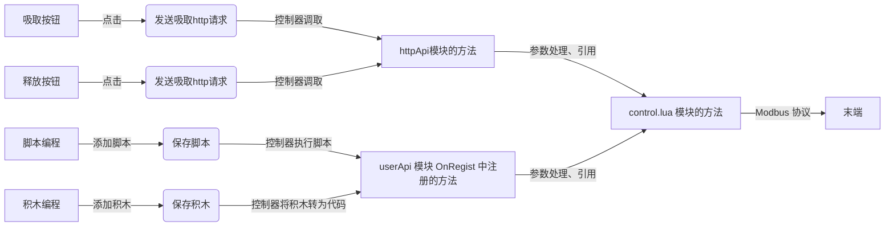
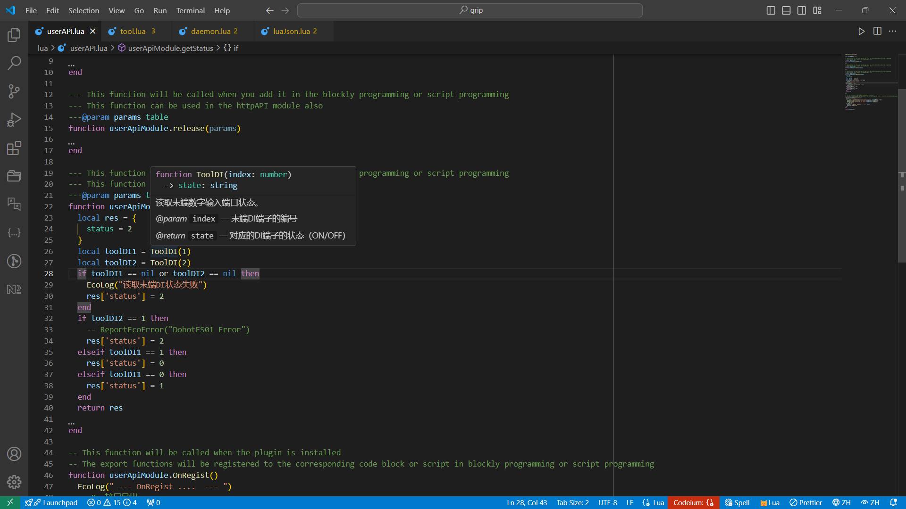

# IO 控制案例

> 该教程会实现控制吸盘吸取和释放的插件。

该插件的工作流程如下：



## 创建插件

```bash
# 需要使用 node v20 及以上版本
dpt create
```

在初始化插件时，需要提供

- 插件的名字，必填，当前文件夹下不得有同名文件夹
- 插件的描述，非必填，可以后续在配置文件中进行修改
- 插件的版本号，默认是 `1-0-0-test`
- 机械臂控制器的 IP 地址，默认是 `192.168.5.1`，可在配置文件中修改

```bash
$ dpt create
? Please input plugin name: io
? Please input plugin description: A plugin demo for io control
? Please input plugin version: 1-0-0
? Please input device IP: 192.168.5.1
```

在完成基础信息的配置和填写后，程序会自动执行安装程序

```bash
Packages: +587
Downloading antd@5.20.3: 9.80 MB/9.80 MB, done
Progress: resolved 588, reused 582, downloaded 5, added 587, done

dependencies:
+ @dobot-plus/components 0.0.0
+ antd 5.20.3
+ axios 1.7.5
+ i18next 23.14.0
+ pubsub-js 1.9.4
+ react 18.3.1
+ react-dom 18.3.1
+ react-i18next 15.0.1
+ react-redux 9.1.2
+ redux 5.0.1

devDependencies:
+ @types/node 20.16.1 (22.5.0 is available)
+ @types/pubsub-js 1.8.6
+ @types/react 18.3.4
+ @types/react-dom 18.3.0
+ @types/react-redux 7.1.33
+ @typescript-eslint/eslint-plugin 7.18.0 (8.3.0 is available)
+ @typescript-eslint/parser 7.18.0 (8.3.0 is available)
+ add 2.0.6
+ css-loader 7.1.2
+ eslint 8.57.0 (9.9.1 is available)
+ eslint-plugin-react-hooks 4.6.2
+ eslint-plugin-react-refresh 0.4.11
+ postcss-loader 8.1.1
+ sass 1.77.8
+ sass-loader 16.0.1
+ style-loader 4.0.0
+ ts-loader 9.5.1
+ typescript 5.5.4
+ url-loader 4.1.1
+ webpack 5.94.0

Done in 39.7s

```

**⚠️ 注意： 在插件文件夹初始化完成后，vscode 会根据配置进行一些插件的安装，请允许该安装过程，并确保该过程顺利，否则会影响后续的 Lua 脚本调试。**

当命令行输出类似上面的内容后，表示一个插件项目的文件夹已经创建完毕。

目录结构如下

```bash
io
├── Resources
│   ├── document
│   │   └── config.json
│   ├── i18n
│   │   ├── client
│   │   │   ├── de.json
│   │   │   ├── en.json
│   │   │   ├── es.json
│   │   │   ├── hk.json
│   │   │   ├── ja.json
│   │   │   ├── ko.json
│   │   │   ├── ru.json
│   │   │   └── zh.json
│   │   └── plugin
│   │       ├── de.json
│   │       ├── en.json
│   │       ├── es.json
│   │       ├── hk.json
│   │       ├── ja.json
│   │       ├── ko.json
│   │       ├── ru.json
│   │       └── zh.json
│   └── images
│       └── pallet.svg
├── configs
│   ├── Blocks.json
│   ├── Main.json
│   ├── Scripts.json
│   └── Toolbar.json
├── dpt.json
├── lua
│   ├── daemon.lua
│   ├── control.lua
│   ├── httpAPI.lua
│   ├── userAPI.lua
│   └── utils
│       ├── await485.lua
│       ├── mqtt.lua
│       ├── num_convert.lua
│       ├── util.lua
│       └── variables.lua
├── package.json
├── pnpm-lock.yaml
├── tsconfig.json
└── ui
    ├── Blocks.tsx
    ├── Main.tsx
    └── Toolbar.tsx
```

## 机械臂&末端控制

机械臂和末端的控制逻辑主要在 `control.lua` 文件中进行编写。
针对该插件的场景，实际需要对外提供三个函数：

- 吸取函数
- 释放函数

针对这三个函数，我们需要依次编写 `control.lua`、`httpApi.lua`和对应的 UI 文件。

- 编辑 `control.lua`

  ```lua
  local control = {}
  -- 定义函数grip用于控制吸取操作
  function control.grip()
      -- 设置第一个端子的输入信号为 ON
      ToolDO(1, 1)
  end

  -- 定义函数release用于释放操作
  function control.release()
      -- 设置第一个端子的输入信号为 OFF
      ToolDO(1, 0)
  end

  return control
  ```

  当鼠标悬停到函数上时，会出现函数的说明、参数类型和返回值

  

- 编写 `httpAPI.lua`

  ```lua
  local control = require('control')
  local httpModule = {}

  -- 添加一个名为 grip 的 http post 请求的处理函数
   httpModule.grip = function()
     control.grip()
      return {
          success = true
      }
  end

  -- 添加一个名为 release 的 http post 请求的处理函数
   httpModule.release = function()
     control.release()
      return {
          success = true
      }
  end

  return httpModule
  ```

- Lua 预调试
  - 在当前项目根目录下运行 `dpt lua`
  - 根据提示选择要在本地执行的 lua 脚本
  - 开发者可自行打印日志，查看调试的 lua 脚本的模块引入、语法、逻辑等是否存在问题

## 控制界面

编写网络请求模块 `.dobot/http/http.ts`

```typescript
import { request } from './axios'

export const grip = (data: any) => {
  return request({
    url: 'grip',
    data
  })
}

export const release = (data: any) => {
  return request({
    url: 'release',
    data
  })
}
```

编写插件的控制界面 `ui/Main.tsx`

```jsx
import { Button } from '@dobot-plus/components'
import { useTranslation } from 'react-i18next'
import { http, DobotPlusApp } from '@dobot/index'

function App() {
  const { t } = useTranslation()

  function handleButton1Click() {
    http.grip()
  }

  function handleButton2Click() {
    http.release()
  }

  return (
    <div className="app">
      <DobotPlusApp>
        <h1>{t('testKey')}</h1>
        <Button type="primary" onClick={handleButton1Click}>
          Grip
        </Button>
        <Button type="primary" onClick={handleButton2Click}>
          Release
        </Button>
      </DobotPlusApp>
    </div>
  )
}

export default App
```

## 调试和验证

调试插件指令可进行以下两种情形的开发工作：

- 仅调试页面
- 连接真机进行调试

```bash
dpt dev
```

在执行上述命令时，命令行会提示开发者是否连接真机进行测试

```bash
$ dpt dev
? Debug lua on real device? Yes
? Please check the device IP: 192.168.5.1 (y/n)
```

开发者需要确定：

- 控制器的真实 IP 是否正确，默认是 `192.168.5.1`
- SFTP 服务相关配置是否正确

上述配置的详细信息请查看 `dpt.json` 配置文件

```json
{
  "ip": "192.168.5.1", // 控制器 IP
  "pluginPort": 22100 // 插件端口号
}
```

在连接真机进行调试时

- 插件连接上控制器、并自动安装成功后，会自动更新插件端口号
- 保存 lua 文件会自动同步至控制器，开发者可在浏览器的界面交互中对机械表末端进行控制。

## 构建插件

在完成插件的开发、调试、优化后，可执行最终的构建工作，执行

```bash
dpt build
```

在程序顺利执行完毕后，当前文件夹下会出现 `dist` 文件夹和 `output` 文件夹。

- `dist` 文件夹中存放着本次构建后的插件代码，用于开发者检查构建结果
- `output` 文件夹存放着压缩后的 `zip` 文件，文件名格式为 `<插件名>-<版本号>.zip`，该文件为实际在客户端导入使用的的插件。

## ⚠️ 注意事项

- 在正常情况下插件工程会根据开发者在 `lua/httpAPI.lua` 模块中编写的方法，自动的生成一个前端请求文件，开发者使用如下方式引入。

  ```javascript
  import { http } from '@dobot/index'
  ```

  引入完毕后，使用 `lua/httpAPI.lua` 同名函数的形式就可以发起 http 请求。

  **示例**

  在 `UI` 文件夹下的 `ts`，`tsx` 文件中

  ```javascript
  // 发起 http 请求，控制器收到请求后调用 httpAPI.lua 中的 grip 函数
  http.grip()

  // 发起 http 请求，控制器收到请求后调用 httpAPI.lua 中的 release 函数
  http.release()
  ```

- 插件会根据 `lua/httpAPI.lua` 自动生成界面需要的 http 配置文件，开发者使用同名函数即可调用。如果用户想自行编写请求配置，可编写 `.dobot/http/api.json` 文件，目前请求仅支持 post 方法。

  ```json
  {
    "requestGrip": {
      "url": "grip"
    },
    "requestRelease": {
      "url": "release"
    }
  }
  ```

  调用时，使用如下方式

  ```javascript
  import { http } from '@dobot/index'

  http.requestGrip()

  http.requestRelease()
  ```

  请求参数中 URL 部分需要和 `httpAPI.lua` 模块中的函数名称对应，表示控制器需要调用的是 `httpAPI.lua` 模块中对应的方法

- `DobotPlusApp` 是一个 react 的高阶组件，内部执行了 Websocket 的建立和插件端口的获取操作

  - useMqtt：是否使用 mqtt 协议接收控制器发送的消息，默认为 false
  - onMessage：在使用 mqtt 协议接收控制器的消息时，处理消息的方法

- 在构建的过程中，`ui` 路径下的第一层的 `.tsx` 文件会被构建成对应的页面
  - `Main.tsx` 对应插件主页面
  - `Toolbar.tsx` 对应插件导航栏栏
  - `Blocks.tsx` 对应插件的积木弹窗页面
  - 其他一级自定义页面也会进行同类型构建，所以请开发者注意 `ui` 文件夹下一级目录中 `.tsx` 文件的命名
