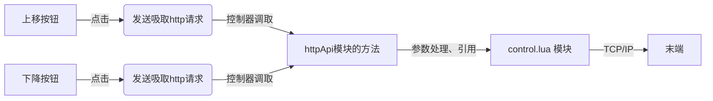

# TCP/IP 控制外部设备

> 插件的新建过程请参考 [IO 控制案例](./01-io.md)，新建插件后请遵循`userAPI.lua`，`httpAPI.lua`，`daemon.lua`，`ui/Main.tsx` 的顺序去完成插件业务逻辑的开发。

## 示例流程



## control.lua 模块

    ```lua
    local control = {}

    ---@param position string
    ---@param socket number
    function control.moveTo(position, socket)
        TCPWrite(socket, "moveTo_absolutePosition"..","..position.."\n")
        TCPRead(socket, 3 , 'string')
    end

    return control

    ```

## httpAPI.lua 模块

```lua
local httpModule = {}
local control = require('control')

local socket = nil

---移动升降柱
httpModule.moveTo = function(params)
  if socket then
    control.moveTo(params.position, socket)
  end
  return {
    status = true
  }
end

---初始化 TCP 连接
httpModule.init = function(params)
  local result = CreateTCPConnection(params.ip, params.port, 10000)
  if result.socket then
    socket = result.socket
  end
  return {
    status = true
  }
end

return httpModule
```

## .dobot/http/http.ts 模块

```typescript
import { request } from './axios'

export const init = (data: any) => {
  return request({
    url: 'init',
    data
  })
}

export const moveTo = (data: any) => {
  return request({
    url: 'moveTo',
    data
  })
}
```

## ui/Main.tsx 模块

```jsx
import { Button } from '@dobot-plus/components'
import { useEffect, useState } from 'react'
import { http, DobotPlusApp } from '@dobot/index'

function App() {
  const [position, setPosition] = useState(0)

  function handleButton1Click() {
    http.moveTo({ position: position + 50 })
  }

  function handleButton2Click() {
    http.moveTo({ position: position - 50 })
  }

  useEffect(() => {
    http.init({
      ip: '192.168.5.1', // 默认ip，实际ip变动时这里需要更新
      port: '123' // 这里需要写入实际正确的端口号
    })
  }, [])

  return (
    <div className="app">
      <DobotPlusApp>
        <Button type="primary" onClick={handleButton1Click}>
          Move up
        </Button>
        <Button type="primary" onClick={handleButton2Click}>
          Move down
        </Button>
      </DobotPlusApp>
    </div>
  )
}

export default App
```

## 运行调试

调试插件指令可进行以下两种情形的开发工作：

- 仅调试页面
- 连接真机进行调试

```bash
dpt dev
```

在执行上述命令时，命令行会提示开发者是否连接真机进行测试

```bash
$ dpt dev
? Debug lua on real device? Yes
? Please check the device IP: 192.168.5.1 (y/n)
```

开发者需要确定：

- 控制器的真实 IP 是否正确，默认是 `192.168.5.1`
- SFTP 服务相关配置是否正确

上述配置的详细信息请查看 `dpt.json` 配置文件

```json
{
  "ip": "192.168.5.1", // 控制器 IP
  "pluginPort": 22100
}
```

## 构建插件

在完成插件的开发、调试、优化后，可执行最终的构建工作，执行

```bash
dpt build
```

在程序顺利执行完毕后，当前文件夹下会出现 `dist` 文件夹和 `output` 文件夹。

- `dist` 文件夹中存放着本次构建后的插件代码，用于开发者检查构建结果
- `output` 文件夹存放着压缩后的 `zip` 文件，文件名格式为 `<插件名>-<版本号>.zip`，该文件为实际在客户端导入使用的的插件。
