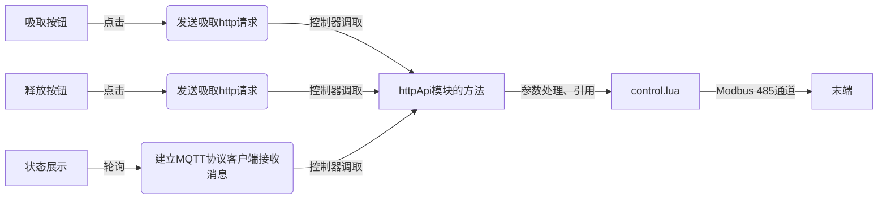

# 控制末端夹爪

> 该示例会完成一个吸盘插件的开发，用于吸盘末端的吸取和释放工件。

## 插件初始化

插件的初始化工作可以参考 [IO 控制案例](./01-io.md) 的初始化过程。

## 插件工作流程

该插件的工作流程如下：



## 控制功能

编写 `control.lua`

```lua
local numConvert = require('utils.num_convert')
local control = {}
local modbusID = nil

-- 定义函数grip用于控制吸取操作
function control.grip(id)

    if modbusID == nil then
        local err, _modbus = ModbusCreate("127.0.0.1", 60000, id, true)
        if err ~= 0 then
            -- 创建 modbus 连接失败
            return nil
        else
            -- 创建 modbus 连接成功
            modbusID = _modbus
        end
    end

    if modbusID ~= nil then
        local gripCmd = tonumber('00001001'..'00000000', 2)
        local gripParams = 0
        WriteBy485(modbusID, 0x03E8, { gripCmd, gripParams })
    end
end

function control.release(id)

    if modbusID == nil then
        local err, _modbus = ModbusCreate("127.0.0.1", 60000, id, true)
        if err ~= 0 then
            -- 创建 modbus 连接失败
            return nil
        else
            -- 创建 modbus 连接成功
            modbusID = _modbus
        end
    end

    if modbusID ~= nil then
        local releaseCmd = tonumber('00001001'..'00000000', 2)
        local releaseParams = 100
        WriteBy485(modbusID, 0x03E8, { releaseCmd, releaseParams })
    end
end

---@param id number
---@return table|nil status
function control.getStatus(id)
    if modbusID == nil then
        local err, _modbus = ModbusCreate("127.0.0.1", 60000, id, true)
        if err ~= 0 then
            -- 创建 modbus 连接失败
            return nil
        else
            -- 创建 modbus 连接成功
            modbusID = _modbus
        end
    end

    local status = false
    if modbusID ~= nil then
        Use485()
        local registerData = GetHoldRegs(modbusID, 0x07D0, 3)
        UnLock485()
        if registerData[1] == nil then
            return false
        end
        local bitData = numConvert.decimalToBinary(registerData[1])
        return string.sub(bitData, -6, -5) == '11'
    end

    return status
end

return control
```

## 网络请求

编写 `httpAPI.lua`

```lua
local httpModule = {}
local control = require("control")

-- 定义函数grip用于控制吸取操作
function httpModule.grip(params)
    control.grip(params.id)
    return {
        status = true
    }
end

function httpModule.release = function(params)
    control.release(params.id)
    return {
        status = true
    }
end

return httpModule
```

## 状态同步

- 编写 `lua/daemon.lua`

```lua
local control = require('control')

local function handleInLoop()
    -- Epick 吸盘 id 默认为 9
    local data = control.getStatus(9)
    if data ~= nil or data ~= false then
        mqtt.publish(data)
    else
        mqtt.publish({
            status = false
        })
    end
end
```

- 编写 `.dobot/http/http.ts`

```typescript
import { request } from './axios'

export const grip = (data: any) => {
  return request({
    url: 'grip',
    data
  })
}

export const release = (data: any) => {
  return request({
    url: 'release',
    data
  })
}
```

- 编写 `ui/Main.tsx`

```jsx
import { Button, StatusLight } from '@dobot-plus/components'
import { useState } from 'react'
import { useTranslation } from 'react-i18next'
import { http } from '@dobot/http/http'
import { DobotPlusApp } from '@dobot/components/DobotPlusApp'

function App() {
const { t } = useTranslation()

const [status, setStatus] = useState(false)

function handleButton1Click() { http.grip({id: 9 }) }

function handleButton2Click() { http.release({ id: 9 }) }

function handleMessage(data: object | string) {
    if (typeof data === 'object') {
        const { status } = data as { status: boolean }
        setStatus(status)
    }
}

return (
    <div className="app">
        <DobotPlusApp useMqtt={true} onMessage={handleMessage}>
            <Button type="primary" onClick={handleButton1Click}>Grip</Button>
            <Button type="primary" onClick={handleButton2Click}>Release</Button>
            <StatusLight status={status ? 'success' : 'error'}
                statusText={status ? '正常' : '异常'}>
            </StatusLight>
        </DobotPlusApp>
    </div>
    )
}

export default App

```

## 调试和验证

调试插件指令可进行以下两种情形的开发工作：

- 仅调试页面
- 连接真机进行调试

```bash
dpt dev
```

在执行上述命令时，命令行会提示开发者是否连接真机进行测试

```bash
$ dpt dev
? Debug lua on real device? Yes
? Please check the device IP: 192.168.5.1 (y/n)
```

开发者需要确定：

- 控制器的真实 IP 是否正确，默认是 `192.168.5.1`
- SFTP 服务相关配置是否正确

上述配置的详细信息请查看 `dpt.json` 配置文件

```json
{
  "ip": "192.168.5.1", // 控制器 IP
  "pluginPort": 22100
}
```

## 构建插件

在完成插件的开发、调试、优化后，可执行最终的构建工作，执行

```bash
dpt build
```

在程序顺利执行完毕后，当前文件夹下会出现 `dist` 文件夹和 `output` 文件夹。

- `dist` 文件夹中存放着本次构建后的插件代码，用于开发者检查构建结果
- `output` 文件夹存放着压缩后的 `zip` 文件，文件名格式为 `<插件名>-<版本号>.zip`，该文件为实际在客户端导入使用的的插件。
