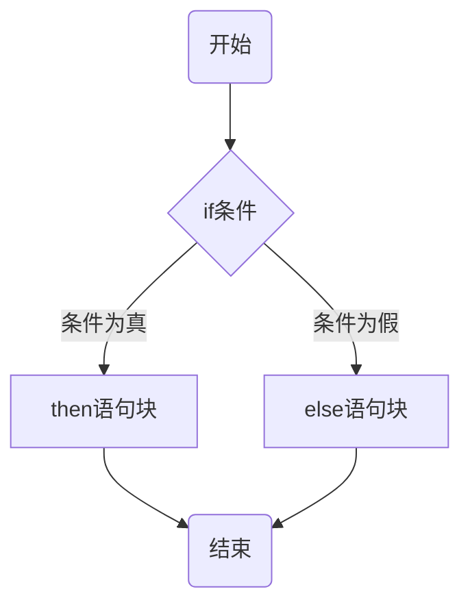
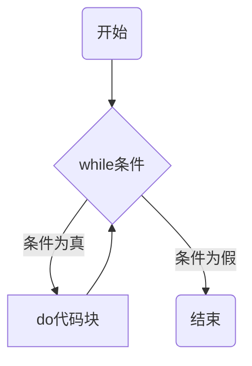
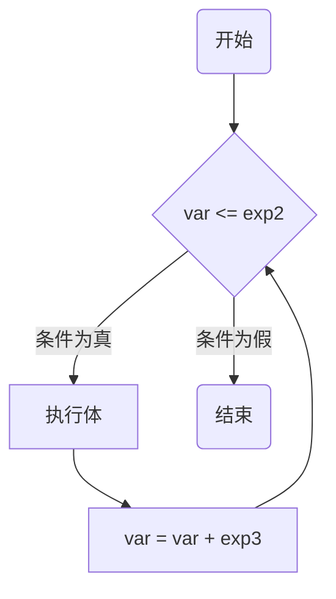
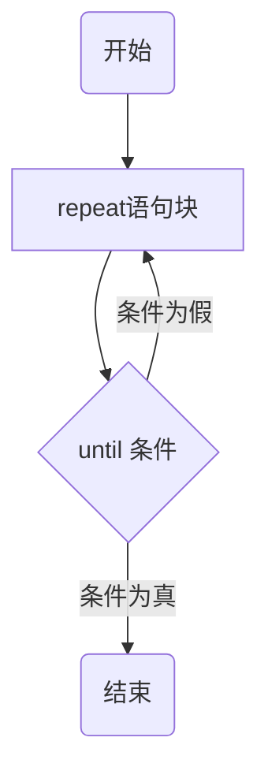

# 流程控制

> 不同版本的控制器、插件和上位机支持不同的 lua API 指令，开发者可在 DobotStudio Pro “应用” 菜单，“脚本编程” 的指令侧边栏查看具体支持的 lua API

| 指令符号         | 说明                                                                                                                     |
| ---------------- | ------------------------------------------------------------------------------------------------------------------------ | --------------------------- |
| if…then…else…end | if 条件判断指令。从上到下依次判断条件是否成立，如果某个判断为 true，执行完对应的代码块，后面的条件判断直接忽略，不再执行 |
| while…do…end     | while 循环控制指令。在条件为 true 时，让程序重复地执行某些语句。执行语                                                   | 句前会先检查条件是否为 true |
| for…do…end       | for 循环控制指令，重复执行指定语句，重复次数可在 for 语句中控制                                                          |
| repeat… until()  | repeat 循环控制指令。重复执行循环，直到 指定的条件为真时为止                                                             |

示例：

## if 条件判断指令

if 后的括号内为条件表达式，表达式的结果可以是任何值，Lua 把 false 和 nil 看作是假，其他的都为真，数字 0 也是真。表达式为真时，执行 then 语句块；表达式为假时，如果有 else 语句块，执行 else 语句块，否则直接执行 end 之后的语句。



if 语句可嵌套使用，下面是一个典型示例。

```lua
a = 100;
b = 200;
--[ 检查条件 --]
if(a == 100)
then
    --[if条件为true时执行以下if条件判断--]
    if(b == 200)
    then
        --[if条件为true时执行该语句块--]
        print("a 的值为:", a )  -- a 的值为:100
        print("b 的值为:", b )  -- b 的值为:200
    end
else
    --[第一个if条件为false时执行以下语句块--]
    print("a不等于100")
end
```

## while 循环控制指令

while 后的括号内为条件表达式，为真时执行 do 语句块，然后重新判断条件；为假时直接执行 end 之后的语句。



示例：

```lua
a=10
while( a < 20 )
do
    print("a 的值为:", a)  -- 执行10次，输出值为10到19
    a = a+1
end
```

## for 循环控制指令

for 循环的语法格式如下：

```lua
for var=exp1,exp2,exp3 do
    <执行体>
end
```

变量 var 的起始值为 exp1，每次执行一次\<执行体>后 var 递增 exp3（exp3 的值可以为负，也可不指定，默认值为 1），直至 var 大于 exp2。



示例：

```lua
for i=10,1,-1 do
    print(i) -- 执行10次，输出值为10到1
end
```

## repeat 循环控制指令

repeat 循环与 while 循环类似，主要区别在于 while 是执行要循环的语句前先判断条件，条件为真时进行循环；repeat 是在执行完要循环的语句后再判断条件，条件为假时进行循环。



示例：

```lua
a = 10
repeat
    print("a的值为:", a) -- 执行5次，输出值为10到15
    a = a + 1
until(a > 15)
```
