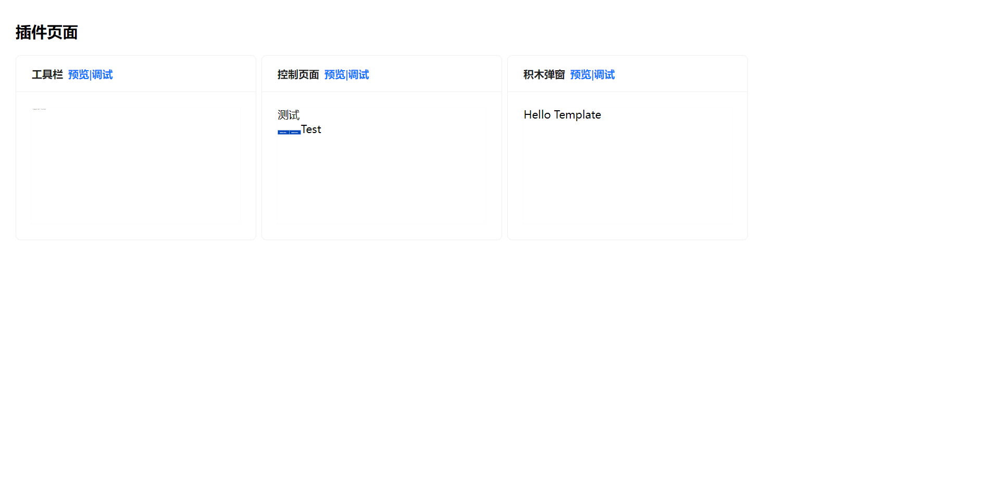
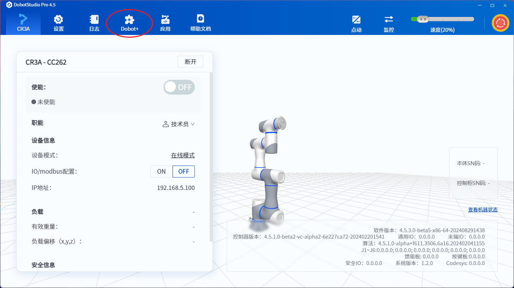
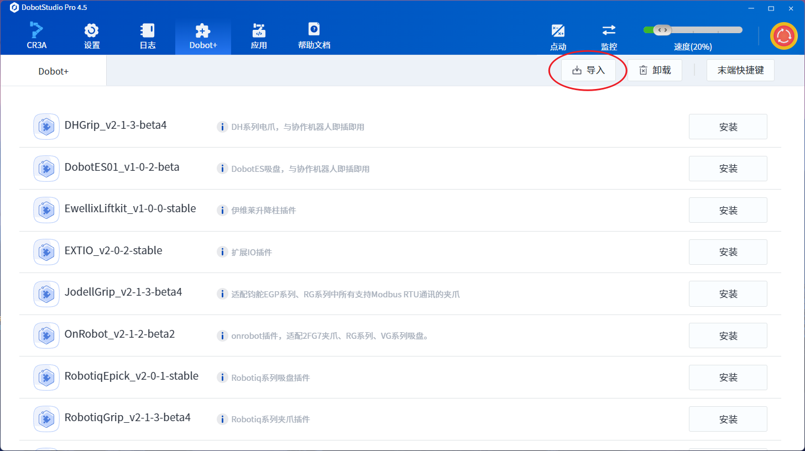
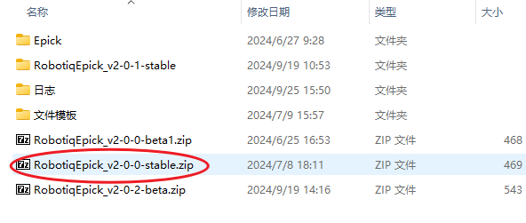

# 快速入门

> 本章节将会为你介绍 Dobot+生态配件开发流程，项目资源结构，以及相关概念

Dobot+ 生态插件开发工具集由以下 npm 包构成，其中 @dobot-plus/cli 为开发 Dobot+ 插件的基础工具包。

| npm 包                                                                         | 用途                                                  |
| ------------------------------------------------------------------------------ | ----------------------------------------------------- |
| [@dobot-plus/cli](https://www.npmjs.com/package/@dobot-plus/cli)               | Dobot+ 插件开发命令行工具，涉及项目初始化、调试、打包 |
| [@dobot-plus/lua](https://www.npmjs.com/package/@dobot-plus/lua)               | Dobot+ 插件 lua 部分语法检查                          |
| [@dobot-plus/gui](https://www.npmjs.com/package/@dobot-plus/gui)               | Dobot+ 插件积木编程、脚本编程可视化配置工具           |
| [@dobot-plus/components](https://www.npmjs.com/package/@dobot-plus/components) | Dobot+ 插件官方组件库                                 |
| [@dobot-plus/template](https://www.npmjs.com/package/@dobot-plus/template)     | Dobot+ 插件项目模板                                   |

## 安装

执行以下脚本安装该开发者工具。

```bash
npm install -g @dobot-plus/cli
```

在成功安装后，系统中会自动注册名为 `dpt` 的命令行工具

```bash
$ dpt
Usage: dpt [options] [command]

dobot plugin toolkit

Options:
  -v, --version    output the version number
  -h, --help       display help for command

Commands:
  create           create a new plugin
  dev [options]
  lua              run lua scripts
  gui [options]    config the project with web GUI
  build [options]  build plugin for production
  help [command]   display help for command
```

## 创建插件

执行以下命令可以创建一个新的插件文件夹

```bash
dpt create
```

该指令需要开发者提供：

- 插件名，插件名不得与当前路径下子文件夹同名
- 描述，可选，默认为空
- 版本号，默认 1-0-0-test，版本号请遵循 `[主版本]-[次要版本]-[更新/修复]-[版本状态]` 使用 `-` 连接的格式，版本状态使用小写字符表示，建议使用 `test`，`stable`，`rc` 等字段
- 真机的 ip 地址，默认是 `192.168.5.1` 后续调试可变更

当根据提示完成对应的必须信息的填写之后，该工具会创建一个开发者指定名字的文件夹，文件夹内有开发插件必须的源码模板，并且会自动安装好开发所需的依赖。  
当创建插件成功后会展示如下类似信息。

```bash
 $ dpt create
? Please input plugin name
 my-plugin
? Please input plugin description This is a description
? Please input plugin version 1-0-0

Packages: +345
++++++++++++++++++++++++++++++++++++++++++++++++++++++++++++++++++++++++++++++++++++++++++++++++++++++++++++++++++++++++++++++++++++++++++++++++++++++++++++
Progress: resolved 346, reused 343, downloaded 2, added 345, done

dependencies:
+ antd 5.20.1
+ axios 1.7.3
+ i18next 23.12.3
+ pubsub-js 1.9.4
+ react 18.3.1
+ react-dom 18.3.1
+ react-i18next 15.0.1
+ react-redux 9.1.2
+ redux 5.0.1

devDependencies:
+ @types/node 20.14.15 (22.2.0 is available)
+ @types/pubsub-js 1.8.6
+ @types/react 18.3.3
+ @types/react-dom 18.3.0
+ @types/react-redux 7.1.33
+ @typescript-eslint/eslint-plugin 7.18.0 (8.1.0 is available)
+ @typescript-eslint/parser 7.18.0 (8.1.0 is available)
+ add 2.0.6
+ css-loader 7.1.2
+ eslint 8.57.0 (9.9.0 is available)
+ eslint-plugin-react-hooks 4.6.2
+ eslint-plugin-react-refresh 0.4.9
+ postcss-loader 8.1.1
+ sass 1.77.8
+ sass-loader 16.0.0
+ style-loader 4.0.0
+ ts-loader 9.5.1
+ typescript 5.5.4
+ url-loader 4.1.1
+ webpack 5.93.0

Done in 24.3s
```

如果在安装过程中存在问题，开发者可以进入当前目录下新建的插件文件夹，并手动安装开发所需的依赖。

```bash
npm install
```

_⚠️ 安装过程中会自动执行 `pnpm` 的安装步骤，请允许该操作。部分依赖出现 `warning` 告警属于正常现象，实际初始化成功与否以最后的日志为准。_

## 文件结构

> Dobot+生态配件分为插件安装界面、图形化编程积木、脚本编程指令三大模块，都由 config.json 配置参数，同时支持国际化翻译以及快捷栏导航功能。

```bash
my-plugin
├── .dobot # 工具内置的方法、组件、lua脚本等
├── .vscode # vscode 配置文件
├── Resources # 资源文件夹
│   ├── document
│   │   └── config.json
│   ├── i18n # 国际化资源
│   │   ├── client # 积木编程、脚本编程、插件在客户端展示的翻译资源
│   │   │   ├── de.json # 德语
│   │   │   ├── en.json # 英语
│   │   │   ├── es.json # 西班牙语
│   │   │   ├── hk.json # 繁体中文
│   │   │   ├── ja.json # 日语
│   │   │   ├── ko.json # 韩语
│   │   │   ├── ru.json # 俄语
│   │   │   └── zh.json # 中文
│   │   └── plugin # 插件 UI 界面的国际化翻译资源
│   │       ├── de.json
│   │       ├── en.json
│   │       ├── es.json
│   │       ├── hk.json
│   │       ├── ja.json
│   │       ├── ko.json
│   │       ├── ru.json
│   │       └── zh.json
│   └── images
│       └── pallet.svg
├── configs # 配置文件
│   ├── Blocks.json  # 积木编程配置文件
│   ├── Main.json    # 插件信息配置文件
│   ├── Scripts.json # 函数编程配置文件
│   └── Toolbar.json # 工具栏配置文件
├── dpt.json # 调试用的控制器配置文件
├── lua # 控制器lua脚本文件夹
│   ├── daemon.lua  # 主进程
│   ├── httpAPI.lua # 响应http请求的进程
│   ├── userAPI.lua # 脚本编程、积木编程对外接口进程
│   ├── PluginName.lua # 插件业务模块，实现脚本编程和http通讯的代码复用
│   └── PluginName  # 插件业务模块
│       ├── modbus.lua # modbus读写寄存器数据
│       ├── mqtt.lua # mqtt 连接工具
│       └── variables.lua # 变量模块
├── package.json
├── pnpm-lock.yaml
├── tsconfig.json
└── ui # 插件UI界面
    ├── Blocks.tsx # 积木弹窗页面
    ├── Main.tsx # 插件主页面
    └── Toolbar.tsx # 插件工具栏
```

- `Resources` 文件夹中的内容主要存放静态资源包括但不限于图片、视频、国际化的翻译，开发者可以根据自己的需求在该文件夹下进行新增。
- `lua` 文件夹存储的是 lua 脚本，在插件安装完成后，控制器使用 lua 脚本控制机械臂和末端工具。
  - `daemon.lua` - 主进程，当插件安装完成后，lua 的主进程会自动唤起，执行该脚本中的程序
  - `httpAPI.lua` - http 模块，GUI 界面通过 post 请求发送数据到控制器，控制器调用 http 模块对应的方法进行机械臂和末端的控制。
  - `userAPI.lua` - 对应脚本编程和积木编程的功能，使用脚本编程和积木编程时，会根据相关的配置调用该模块中的方法。
  - `PluginName.lua` - 插件的业务逻辑主体，用于在脚本编程和http通讯时服用插件业务逻辑代码
  - `PluginName` -
    - `modbus.lua` - 机械臂通过 485 通道和末端进行数据通信，该模块封装了对 485 通道的锁操作，用于去读取和写入数据。
    - `mqtt.lua` - 控制器建立 mqtt 连接的工具，用于控制器向上位机推送消息。
    - `variables.lua` - 常量和变量的定义。

## 开发调试

开发插件需要先规划插件安装界面需要提供的功能，继而整理功能接口，前后端分离模式，Dobot+生态配件页面开发使用[前端 React 框架](https://react.docschina.org/learn)，接口开发使用[Lua](https://www.lua.org/pil/contents.html)

开发调试阶段 `dpt` 指令需要运行于插件项目文件夹下，使用 `cd` 指令进入对应的插件项目文件夹

```bash
# 例如 cd c:/users/username/testPlugin
cd 插件项目路径
```

### 第一步：主控制界面

- 在 `ui/Main.tsx` 文件夹下开发插件的主控制界面
- 在 `configs/Main.json` 配置插件安装界面需要展示的插件基本信息，包括插件名称、版本号和描述信息
  在页面开发时，可以使用以下命令进行页面样式调整和事件绑定

```bash
dpt dev
```

运行结果如下（部分内容省略）

```bash
dpt dev
Starting server...
<i> [webpack-dev-server] Project is running at:
<i> [webpack-dev-server] Loopback: http://localhost:8080/
<i> [webpack-dev-server] On Your Network (IPv4): http://192.168.111.51:8080/
<i> [webpack-dev-server] Content not from webpack is served from
...
...
webpack 5.93.0 compiled successfully in 7147 ms
```

等待页面编译完成，点击需要调试的页面的 `预览|调试` 按钮，可以进入对应的预览页面



### 第二步：插件与控制器通信

导航栏和插件控制界面通过 http 协议与控制器进行通信。控制器在接收到软件的 http 请求后，根据请求的 url 来寻找对应插件和具体函数，并执行该函数。

例如：

- UI 界面点击按钮后，发送请求：http://192.168.5.1:22001/pluginName/testMethod
- 上位机在接收到 http 请求后，根据 `pluginName` 查找控制器中已安装的插件，并在该插件 `lua/httpAPI.lua` 文件中查找名为 `testMethod` 的函数。
- 当正确查找到 `testMethod` 函数后，控制器会执行该函数中的 `lua` 代码
- 当函数存在返回时，会将函数的返回值通过 http 响应的形式返回给 UI 界面

## 配置图形化编程积木

### 第一步：配置积木

在插件项目的 `configs/Blocks.json` 文件中配置积木编程的相关信息。具体配置项，请参考 [积木配置章节](/api/blocky)

### 第二步：积木脚本

积木编程中，每一个积木模块需要执行一定的 `lua` 代码。用户可自行编写，也可以使用插件中提供的方法。

例如

在 `lua/userAPI.lua` 文件中有 `OnRegist` 方法。该函数会在插件安装后执行。并将部分函数对外暴露给积木和脚本编程模块。

```lua
function userApiModule.OnRegist()
	EcoLog(" --- OnRegist ....  --- ")
	-- 0. 接口导出
	local isErr = ExportFunction("test", userApiModule.demoMethod1) or
		ExportFunction("demo", userApiModule.demoMethod2) or
		ExportFunction("example", userApiModule.demoMethod3)
	-- 1. 错误的处理
	if isErr then
		EcoLog(" --- ERR to  register .... --- ", isErr)
		dobotTool.SetError(0)
	end
end
```

上面的这段代码中：

- 将 userApiModule 模块中的 demoMethod1 函数暴露给名为 test 的函数
- 将 userApiModule 模块中的 demoMethod2 函数暴露给名为 demo 的函数
- 将 userApiModule 模块中的 demoMethod3 函数暴露给名为 example 的函数

在积木编程的配置中，`block_code` 字段下，就可以使用名为 `test` ，`demo` ，`example` 的函数。

## 配置脚本编程

### 第一步：配置指令

在插件项目的 `configs/Scripts.json` 文件中配置指令参数

参阅[脚本指令配置参数](/api/script)以学习指令生成配置方法

## 多语言

国际化内容分为两块

- `Resources/i18n/client`: 针对插件在客户端中使用场景的翻译，包括插件描述、积木翻译、脚本编程翻译等
- `Resources/i18n/plugin`: 插件安装后，控制页面中的国际化翻译部分

找到 `Resources/i18n/client`，可以按照对应语言包配置多语言翻译

以中英文翻译为例

- 在 `Resources/i18n/client/zh.json` 中`config`字段下添加

  ```js
  {
    "config": {
      "tr_description": "扩展IO插件"
    }
  }
  ```

- 在 `Resources/i18n/client/en.json` 中`config`字段下添加

  ```js
  {
    "config": {
      "tr_description": "Extended IO plugin"
    }
  }
  ```

- 在 `configs/Main.json` 中使用
  ```js
  {
    "name": "EXTIO",
    "version": 1,
    "description": "%{tr_description}"
  }
  ```

按照上面的方法，就可以根据 DobotStudio Pro 软件界面的语言展示对应的翻译语言

**注意**

如果使用多语言，必须至少配置简体中文和 English 两种语言下的翻译，默认显示英文翻译

## 构建和使用

### 构建插件

在完成插件的开发、调试、优化后，可执行最终的构建工作，执行

```bash
dpt build
```

在程序顺利执行完毕后，当前文件夹下会出现 `dist` 文件夹和 `output` 文件夹。

- `dist` 文件夹中存放着本次构建后的插件代码，用于开发者检查构建结果
- `output` 文件夹存放着压缩后的 `zip` 文件，文件名格式为 `<插件名>-<版本号>.zip`，该文件为实际在客户端导入使用的的插件。

### 使用插件

- 导航栏入口
  

- 导入插件
  

同名插件在导入前需要先卸载已安装的插件

- 选择插件压缩包  
  

插件压缩包为 zip 格式的压缩文件，命名格式为  
 `<插件名>_v<主版本号>-<次要更新版本号>-<修复版本号>-<版本状态：test、stable、rc>.zip`
