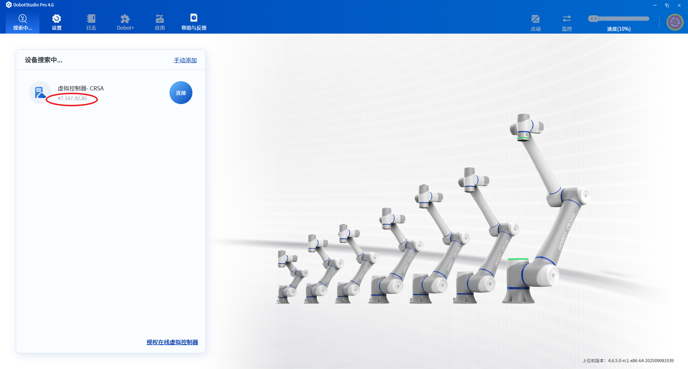

# 使用虚拟控制器进行调试

在进行 Dobot+ 插件开发的时候，开发者可以选择连接真实的机器进行开发和调试，当真机缺少时，开发者仍旧可以选择连接虚拟控制器进行插件的开发和调试。

## 申请虚拟控制器

开发者可以在越疆的官网申请虚拟控制器 [https://www.dobot.cn/virtual.html](https://www.dobot.cn/virtual.html)

在获得虚拟控制器授权码后，开发者需要打开 DobotStudio Pro 客户端，进行虚拟控制器的授权。

，DobotStudio Pro 界面会在设备列表中展示虚拟控制器。开发者需要将该虚拟控制器的 IP 配置到 Dobot+ 插件项目中。

## Dobot+ 插件配置

在顺利完成上面的操作后，开发者可以获得虚拟机器的 IP，在 Dobot+ 的项目中，找到根目录下的 `dpt.json` 文件

```json
{
  "ip": "47.107.92.85",
  "port": 22001
}
```

修改 IP 字段的地址为虚拟控制器的 IP。

## 运行调试

在完成虚拟控制器地址的配置后，在项目根目录下，运行调试指令

```bash
dpt dev
```

浏览器会打开 `http://localhost:8080/` 网址，在此网站可以正常访问时，即表示界面和控制器连接是正常可用的，在修改项目的 lua 文件时，该站点会执行重启操作，重启完成后，表示开发者的 lua 代码已成功同步至控制器中，并生效工作。
