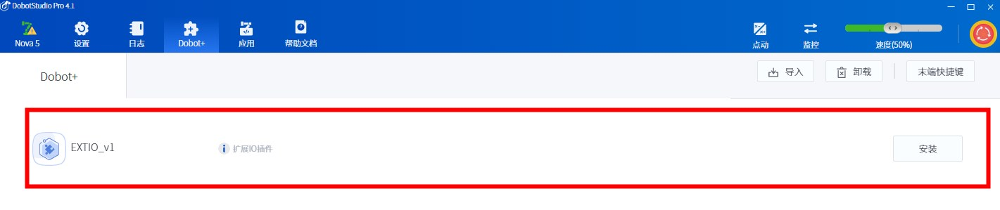

# Basic Configuration

> In Dobot+ resources, each module is configured using `json` format files to set up page parameters and displays. This chapter will introduce how to configure the installation page's related content, including:
- How to configure `config.json`
- How to create and develop related pages
- How to debug pages

## Configuring `config.json`

Locate `configs/Main.json` and refer to the following example to configure your installation interface.

### JSON Content

```json
{
  "name": "EXTIO",
  "version": 1,
  "description": "Extended IO Plugin"
}
```

### Description of Fields

| Field       | Type           | Default Value | Required | Description                             |
|-------------|----------------|---------------|----------|-----------------------------------------|
| `name`      | string         | None          | Yes      | The name of the installation interface plugin. |
| `version`   | number/string   | None          | Yes      | The version number of the plugin, used to differentiate between different versions. |
| `description` | string       | None          | Yes      | A brief description of the installation interface plugin. |
| `hotkey`    | boolean        | None          | No       | Set to `true` if hotkey operations for the end effector need to be configured. |

### Dobot+ Interface Display Effect

The display of the plugin in the Dobot+ interface will look like the following:



## Hotkey Configuration

The plugin supports the configuration of end effector hotkeys, allowing for quick execution of specific commands. For more details on how to configure hotkey operations for the end effector, refer to the [Hotkey Configuration](https://yourlinkhere) documentation.
