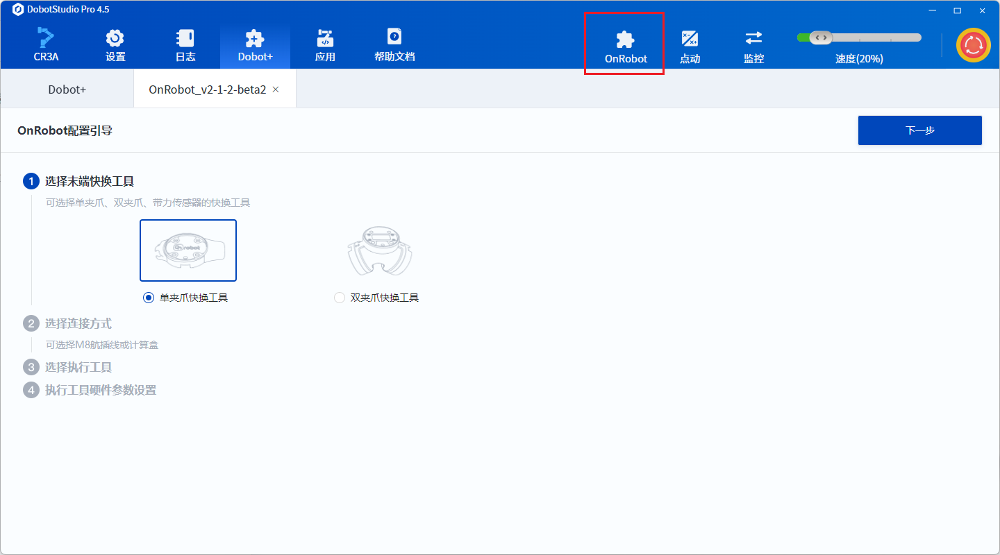
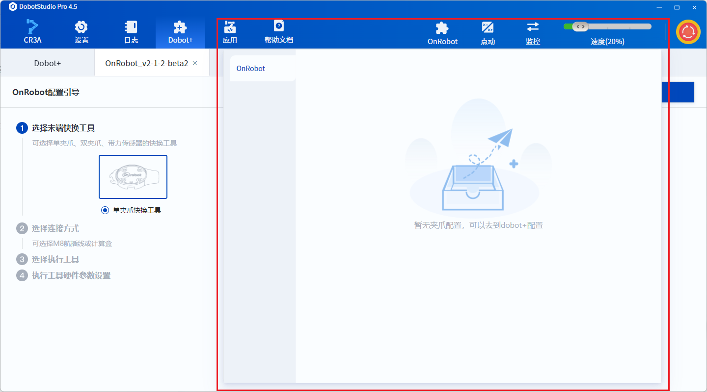

# Navigation Bar

> After installing the plugin, you can configure a navigation bar for quick operations. Locate `configs/Toolbar.json` and customize the navigation bar page by specifying parameters.

This chapter will introduce how to configure the quick navigation bar:
- You will learn how to customize the navigation bar.
- You will learn how to debug the navigation bar online.

## Navigation Bar

The navigation bar is located at the top menu of the upper computer.



It is commonly used to quickly view plugin status and operate the plugin while switching between interfaces.



## Customizing the Navigation Bar

### JSON Content

```json
{
  "name": "DHGrip",
  "icon": "grip.svg",
  "width": 800,
  "height": 900
}
```

### Description of Fields

| Field   | Type          | Default Value | Required | Description                               |
|---------|---------------|---------------|----------|-------------------------------------------|
| `name`  | string        | None          | Yes      | The display name of the navigation bar.   |
| `icon`  | number/string  | None          | No       | If you need a custom icon, specify the icon path. |
| `width` | number        | None          | No       | If you need to customize the navigation page width, specify the width in pixels. |
| `height`| number        | None          | No       | If you need to customize the navigation page height, specify the height in pixels. |

## Navigation Bar Page Development

The navigation bar page is developed in the `ui/Toolbar.tsx` file, using the [React framework](https://react.docschina.org/learn) for development.
