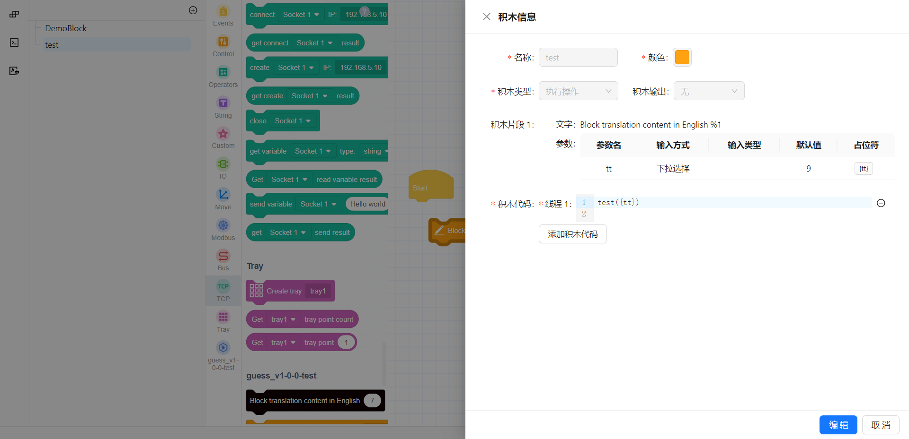
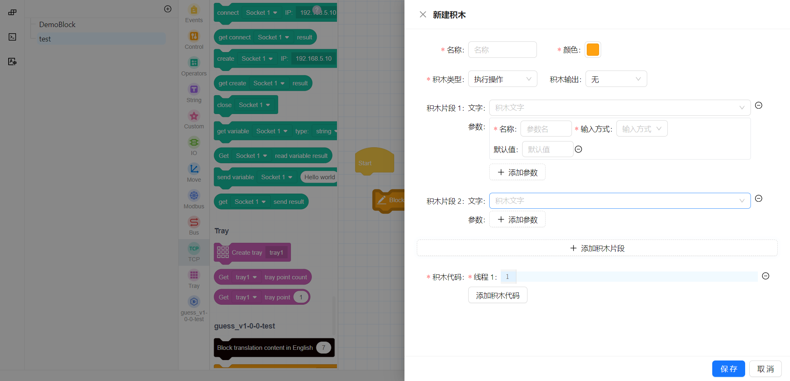
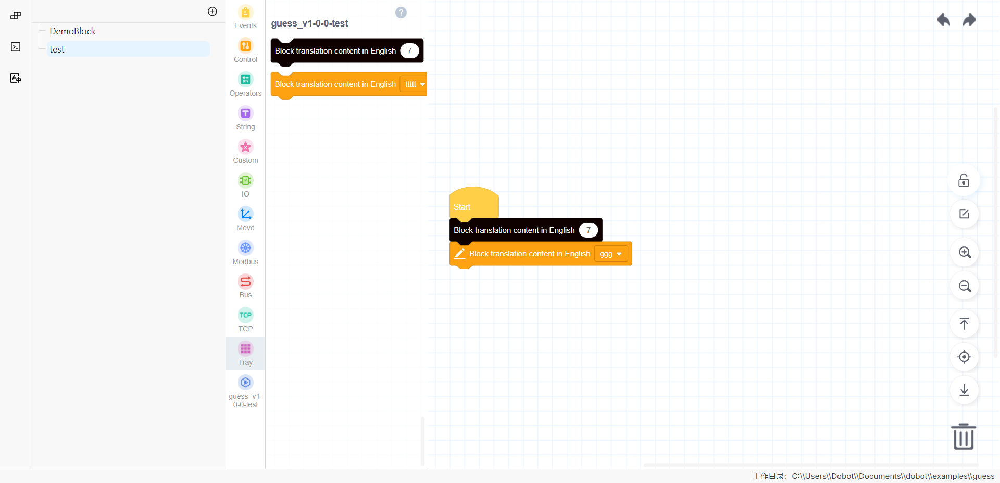

# Blocky Programming

> Graphical programming is the core feature of Dobot+. By configuring to generate corresponding blocks, you can reduce the difficulty of script writing. Locate `src/config/Blocks.json` and customize the blocks you want by specifying parameters.

This chapter will introduce how to configure dynamically generated blocks, and you will learn about:
- How to customize the appearance of blocks
- How to configure block-to-code conversions
- How to support multithreading
- How to customize the menu bar icons
- How to add pop-up pages for blocks
- How to perform internationalization
- How to debug blocks online

## Customizing Blocks

We support executing blocks, returning value blocks, judging blocks, and ending blocks.

### JSON Configuration

```json
{
    "block_name": "SetModbusIODigitOutput",
    "block_color": "#4D7DDD",
    "block_type": "shape_statement"
}
```

### Description of Fields

| Field         | Type                         | Default Value | Required | Description                                        |
|---------------|------------------------------|---------------|----------|----------------------------------------------------|
| `block_name`  | string                       | None          | Yes      | The name of the block function; only pure letters are supported. |
| `block_color` | hexadecimal color string     | None          | Yes      | The color of the block.                            |
| `block_type`  | BLOCK_TYPE                  | None          | Yes      | The shape of the block, indicating the logic used. |

**BLOCK_TYPE**

| Type             | Description                  | Style                                   |
|------------------|------------------------------|-----------------------------------------|
| `shape_statement` | Code block with no output    |  |
| `output_number`   | Code block outputting numbers |  |
| `output_string`   | Code block outputting strings |  |
| `output_boolean`  | Code block outputting booleans |  |
| `shape_end`       | Code block indicating the end of flow |  |
| `shape_hat`       | Code block indicating the start of flow |  |

**Note**: 
- When configuring `block_name`, different blocks cannot repeat; repetition will lead to data overwriting.
- It is recommended to use a uniform color for the same plugin.
- Supports custom parameter types for blocks.

### Custom Parameter Types JSON Configuration

```json
[
    {
      "message": "设置扩展IO数字输出 %1 %2",
      "params": [
        {
          "param_type": "field_dropdown",
          "data_type": "",
          "name": "name",
          "default": "",
          "options": [
            {
              "label": "Modbus_IO1",
              "value": "default"
            }
          ],
          "update": {
            "type": "lua",
            "function": "GetModbusArr",
            "args": {
              "type": "custom",
              "value": "do"
            }
          }
        },
        {
          "param_type": "field_dropdown",
          "data_type": "",
          "name": "do",
          "default": "",
          "options": [
            {
              "label": "DO_101",
              "value": "default"
            }
          ],
          "update": {
            "type": "lua",
            "function": "GetModbusDOArr",
            "args": {
              "type": "field",
              "value": "name"
            }
          }
        }
      ]
    }
]
```

### Description of Fields for Custom Parameters

| Field          | Type                   | Default Value | Required | Description                                      |
|----------------|------------------------|---------------|----------|--------------------------------------------------|
| `message`      | string                 | None          | Yes      | The block uses `%n` for interpolation.          |
| `params`       | ParamsType[]           | None          | Yes      | Definition of block parameters.                  |

**ParamsType**

| Field         | Type                        | Default Value | Required | Description                                      |
|---------------|-----------------------------|---------------|----------|--------------------------------------------------|
| `param_type`  | InputType                   | None          | Yes      | The type of the parameter.                       |
| `data_type`   | `math_number` \| `text`     | None          | No       | The data type.                                   |
| `name`        | string                      | None          | No       | Name for the input field.                        |
| `default`     | string                      | None          | No       | Default value for the parameter.                 |
| `options`     | `{label:string,value:string}[]` | None      | No       | Required when the parameter type is 'field_dropdown'; label is for display, value is the actual value for code conversion. |
| `update`      | updateType                 | None          | No       | HTTP interface call triggered when the block needs to be updated. |

**InputType**

| Type           | Description               |
|----------------|---------------------------|
| `input_value`  | Input box                 |
| `field_dropdown`| Dropdown box              |
| `input_statement`| Nested statement          |

## Block-to-Code Conversion

### JSON Configuration for Code Conversion

```json
{
    "block_code": ["DO({do},{status})"]
}
```

### Description of Fields

| Field         | Type          | Default Value | Required | Description                                       |
|---------------|---------------|---------------|----------|---------------------------------------------------|
| `block_code`  | string[]      | None          | Yes      | Code generated from the block.                    |

**Note**: 
- `shape_statement` and `shape_end` type blocks must have a newline character `/n` added at the end of their code conversion.
- For multithreaded blocks, parameters for code conversion should be in array format, sequentially converted into main thread code (src0.lua), child thread code (src1.lua), (src2.lua), etc.
- Refer to [Advanced Block Configuration](/api/blocky) to learn about complex block configuration methods, such as for welding scenarios.

## Custom Menu Bar Icons

If you need to display custom icons for the menu bar block group, place the icon resources in `Resources/images`. Specify the icon's name in `Blocks.json`, and the icon information will be synchronized with the graphical interface after the plugin is installed.

### JSON Configuration

```json
{
    "block_menuIcon": "grip.png"
}
```

### Description of Fields

| Field           | Type       | Default Value | Required | Description                                |
|------------------|------------|---------------|----------|--------------------------------------------|
| `block_menuIcon` | string     | None          | No       | The menu bar icon path; defaults to the standard icon if not configured. |

## Block Pop-up Pages

Dobot+ blocks support pop-up pages for secondary processing in complex parameter scenarios. Clicking on a block displays a pop-up.

### JSON Configuration

```json
{
    "block_page": "template.html"
}
```

### Description of Fields

| Field         | Type       | Default Value | Required | Description                                      |
|---------------|------------|---------------|----------|--------------------------------------------------|
| `block_page`  | string     | None          | No       | Indicates whether the block has a configuration page; provide the static page path to display a clickable icon. |

## Internationalization

You can configure translations for blocks in the `Resources/i18n/client` folder.

* In `Resources/i18n/client/zh.json`, add to the `blocks` field:

  ```json
  {
    "blocks": {
      "tr_dobot_set_extio": "设置扩展IO数字输出 %1 %2"
    }
  }
  ```

* In `Resources/i18n/client/en.json`, add to the `blocks` field:

  ```json
  {
    "blocks": {
      "tr_dobot_set_extio": "Set extended IO digital output %1 %2"
    }
  }
  ```

* Use the translation in the block:

  ```json
  {
    "block_configs": [
      {
        "message": "%{tr_dobot_set_extio}"
      }
    ]
  }
  ```

**Note**: 
- The `message` configuration uses `%n` for interpolation placeholders, and the quantity must match the items in the `params` configuration; otherwise, the block will fail to load.
- Use `%1` for the first item in the `params` configuration, `%2` for the second, and so on.

## Online Debugging of Blocks

We support online debugging of block configuration parameters, allowing real-time previews of block effects. Execute the following command, and open the corresponding URL in a browser, then click on the block module.

```bash
dpt gui
```

- Click on the block name in the left menu to view block configuration details.


- Click the + button to create a new block.


- After the plugin is successfully created, you can preview the block effect on the page.


- Hover over the left block menu to see a delete button. Click the red delete button to remove any unnecessary blocks.
