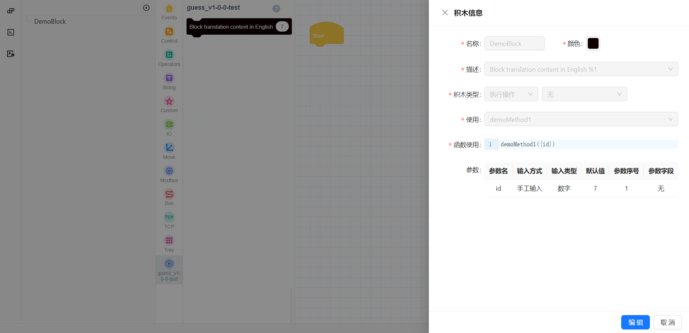
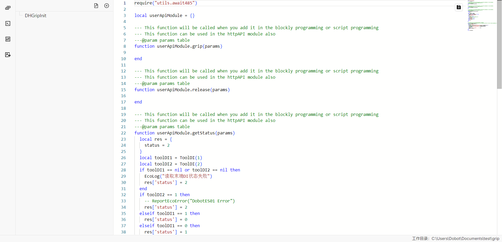
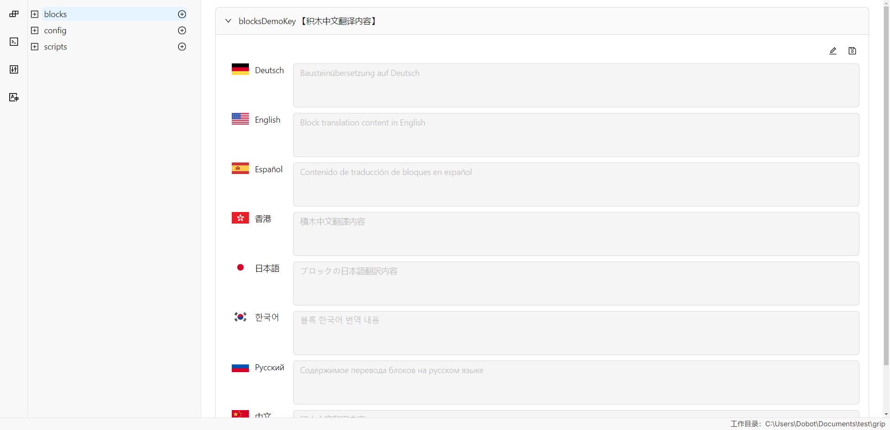

# Command Line

## create
Running this command will guide you through creating a new plugin project. You can set the project's name, version number, and basic structure through a series of prompts. The generated project will include initial configuration files and file structure to facilitate subsequent development.

### Example

```bash
dpt create
```

After using the above command and completing the plugin basic information prompts, the command will:
- Pull the plugin file template.
- Write the user-input basic information into the template.
- Automatically install the dependencies required for plugin development.

If the third step of automatic installation fails, the user can manually install dependencies in the plugin folder:
```bash
pnpm install
```

**Note**  
It is recommended to use `pnpm` for dependency installation. `pnpm` has the following advantages over `yarn`:
- Dependency sharing: Duplicate dependencies can be shared using symlinks, reducing the disk space occupied by plugin dependencies.
- Parallel downloads: Dependencies can be installed faster by sending HTTP requests in parallel.

## dev
Start the development server and synchronize the code to the real device for debugging. After running `dpt dev`, the system will start a Webpack development server and establish a connection with the real device based on the `dpt.json` configuration file. You can choose whether to debug Lua scripts on the real device. If debugging is selected, the system will synchronize the code to the device via SFTP and monitor file changes. Whenever the Lua script changes, the system will automatically update the files on the device and reload the plugin.

### Example

```bash
dpt dev
```

### dpt.json
Basic configuration information for connecting to the real machine for debugging:
```json
{
  "ip": "192.168.5.1",
  "port": 22001,
  "pluginPort": 22100
}
```

| Field      | Description                                              |
|------------|----------------------------------------------------------|
| ip         | The real IP of the controller, default is 192.168.5.1 for wired connection. |
| port       | The public service port of the controller, e.g., for obtaining plugin port, installing, and uninstalling plugins. |
| pluginPort | The HTTP service port number of the current plugin, dynamically updated, and will be dynamically obtained when the plugin is used, corresponding to the port number mapped by the `httpAPI.lua` module. |

Additionally, the synchronization of Lua files uses the SFTP protocol. The specific connection parameters can be found in the `.dobot/.sftprc` file, which generally does not need to be modified by developers.

### Page Preview
This command internally uses Webpack for bundling and supports Webpack's hot update mechanism:
- `http://localhost:8080/Main` - The main control interface of the plugin, displayed when the plugin is clicked after installation.
- `http://localhost:8080/Toolbar` - Display of the plugin's toolbar interface.
- `http://localhost:8080/Blocks` - Custom display interface when clicking on blocks.

## lua
Run Lua scripts and select the target Lua file for execution in the project. This command will list all Lua files in the `./lua` directory and allow you to select a target file to execute. Once selected, the command will run the script using `lua54.exe`, outputting the execution result. This feature is suitable for quickly testing and running Lua code during development.

### Example

Suppose your project structure is as follows:

```
/your-project
│
└── lua/
   ├── script1.lua
   ├── script2.lua
   └── init.lua
```

- After running `dpt lua`, you will see the following prompt:

  ```bash
  Please select target lua file: 
  ❯ script1.lua
    script2.lua
    init.lua
  ```

- After selecting `script1.lua`, the tool will execute the following command:

  ```
  lua54.exe -l init /your-project/lua/script1.lua
  ```

- The script will execute in the `.dobot/lua/` directory, and the output will be displayed in the command line.

## gui
Configure the project through a graphical user interface (GUI). Running this command will start a web GUI interface that allows users to configure the project through a browser. This interface supports real-time preview and interactive operations. If the `--dev` option is specified, the command will start the GUI in development mode, suitable for debugging and development scenarios.

### Example
```bash
dpt gui
```

- Management panel for block programming configuration files

  

- Management panel for function programming configuration files

  

- Editing panel for translation resources of configuration files

    

## build
This command is used to package the project code and generate the final plugin release version. During packaging, the code will be optimized based on the project's Webpack configuration, and the final publishable files will be generated.

### Example
```bash
dpt build
```

During the build process, the first-level `.tsx` files in the `ui/pages` path will be built into corresponding pages:
- `Main.tsx` corresponds to the main page of the plugin.
- `Toolbar.tsx` corresponds to the plugin toolbar.
- `Blocks.tsx` corresponds to the plugin's block pop-up page.
- Other first-level custom pages will also undergo similar builds, so developers should pay attention to the naming of `.tsx` files in the first-level directory of the `ui/pages` folder.

After the program completes successfully, a `dist` folder and an `output` folder will appear in the current folder.
- The `dist` folder contains the plugin code after this build for developers to check the build results.
- The `output` folder contains the compressed `zip` file, with the file name format `<plugin name>-<version>.zip`, which is the plugin actually imported for use in the client.

The folder structure of uncompressed files after building is as follows:
```bash
├── Blocks
│   ├── config.json # Block programming configuration file
│   └── index.html  # Page displayed when clicking on block
├── Main
│   ├── config.json # Basic configuration of the plugin
│   └── index.html
├── Resources
│   ├── document
│   │   └── config.json # Script programming document configuration
│   ├── i18n            # Internationalization translation data
│   │   ├── Deutsch     # German translation
│   │   │   ├── blocks.json  # Block programming translation
│   │   │   ├── config.json  # Basic configuration translation
│   │   │   └── scripts.json # Script programming translation
│   │   ├── English
│   │   │   ├── blocks.json
│   │   │   ├── config.json
│   │   │   └── scripts.json
│   │   ├── Español
│   │   │   ├── blocks.json
│   │   │   ├── config.json
│   │   │   └── scripts.json
│   │   ├── Русский язык
│   │   │   ├── blocks.json
│   │   │   ├── config.json
│   │   │   └── scripts.json
│   │   ├── 日本語
│   │   │   ├── blocks.json
│   │   │   ├── config.json
│   │   │   └── scripts.json
│   │   ├── 简体中文
│   │   │   ├── blocks.json
│   │   │   ├── config.json
│   │   │   └── scripts.json
│   │   ├── 繁體中文
│   │   │   ├── blocks.json
│   │   │   ├── config.json
│   │   │   └── scripts.json
│   │   └── 한국어
│   │       ├── blocks.json
│   │       ├── config.json
│   │       └── scripts.json
│   └── images
│       └── pallet.svg
├── Scripts
│   └── config.json # Script programming configuration file
├── Toolbar
│   ├── config.json
│   └── index.html
├── daemon.lua  # Lua entry file, daemon 
├── httpAPI.lua # Data interaction module between controller and GUI, handles HTTP requests from the GUI interface
├── userAPI.lua # Modules for block programming and script programming, corresponding to the actual methods for controlling the end of the robotic arm
└── utils
    └── await485.lua
```