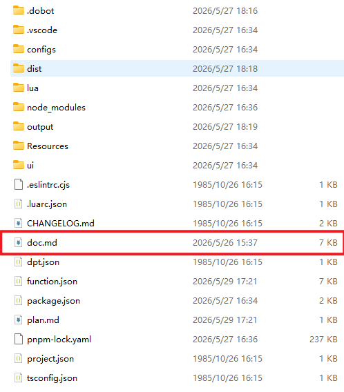
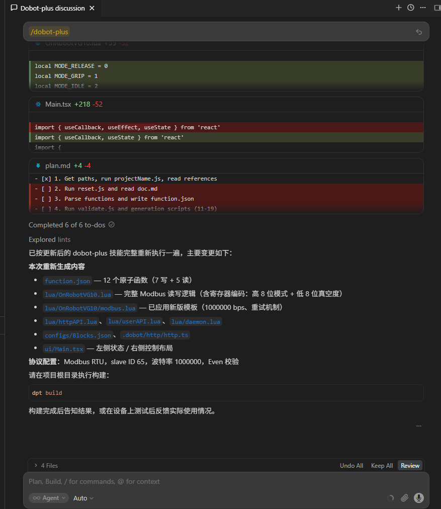
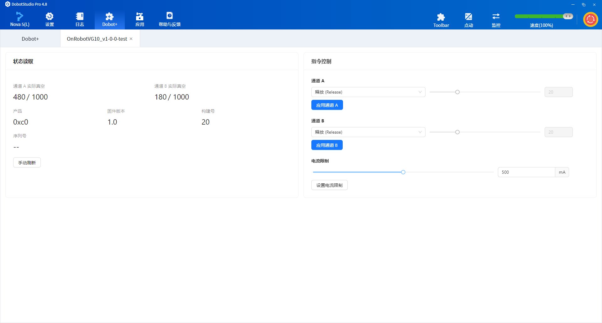
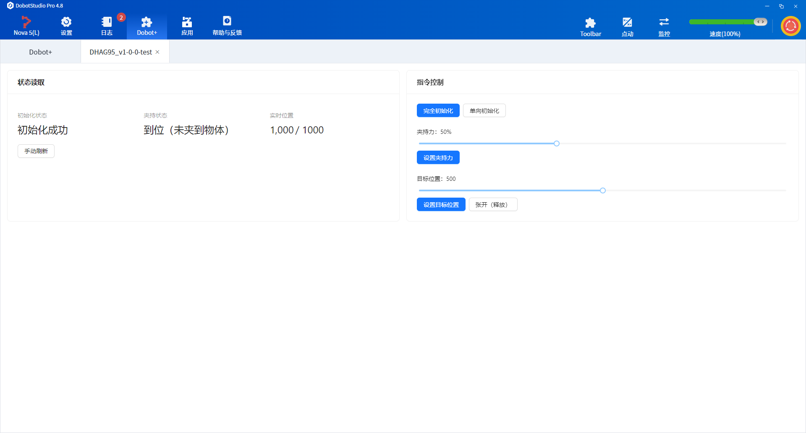
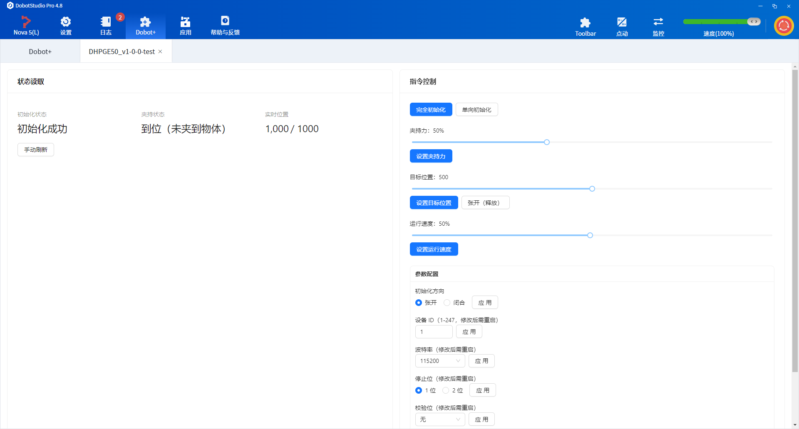

# Adapting Modbus RTU Devices

> This example shows how to use the `dobot-plus` skill in an AI Agent to adapt end effectors that communicate over **Modbus RTU**. Three common devices are covered below: **OnRobot VG10** (vacuum gripper), **DH-Robotics AG-95** (electric gripper), and **DH-Robotics PGE-50** (integrated drive-and-control gripper). Instead of writing Lua, HTTP APIs, and UI pages by hand, the Skill generates plugin scaffolding from your device protocol document—you only need to prepare `doc.md` and invoke `/dobot-plus` in the IDE.

## Workflow


## Environment Setup

Confirm the following before development. See [Development Environment](../../tutorials/01-environment.md) for more detail.

| Dependency | Version / Notes |
| --- | --- |
| Node.js | v20 or later |
| IDE | Supports Agent Skills (e.g. Cursor) |
| @dobot-plus/cli | Global install; provides the `dpt` command |
| @dobot-plus/skill | Global install; provides the `/dobot-plus` skill |

Install:

```bash
npm install -g @dobot-plus/cli @dobot-plus/skill@latest
```

Verify:

```bash
node -v    # Should print v20.x or later
dpt -v     # Confirm CLI works
```

After install, the Skill is deployed to `~/.agents/skills/dobot-plus`. Enable Agent Skills in your IDE settings to use it.

## Writing doc.md (General Requirements)

The Skill **does not** create or modify `doc.md`. You must write a complete device protocol document in the project root.

### Required Content

| Category | Description |
| --- | --- |
| Communication protocol | Protocol type, baud rate, data bits, parity, stop bits |
| Slave address | Modbus RTU `slaveID` (list separately per connection method) |
| Register map | Decimal + hex address, name, read/write access |
| Bit fields / value ranges | High/low bytes, bit meaning, enum values, units, and ranges |
| Function semantics | Each atomic operation exposed externally (read / write / control) |

### Recommended Outline

1. Device overview
2. Communication protocol (Modbus RTU parameters and device address)
3. Register overview
4. Register details (bit fields, enums, units, ranges)
5. Operation flow
6. Version info and safety notes

Split functions into atomic operations whenever possible—each function should do one thing only.

### Generate with AI

If you have a vendor PDF manual, you can ask a general-purpose AI model to turn the protocol content into `doc.md`, review it, and save it in the project root. Copy the prompt below into ChatGPT, Cursor, or similar tools, and attach the PDF text.

Sample AI prompt:

```
You are an industrial device protocol documentation assistant. From the manual content I provide, produce a doc.md device document that meets the requirements below.

## Output requirements
1. Output Markdown only from my materials; do not invent register addresses, bit fields, or parameters
2. Mark uncertain items as "TBD"; do not guess
3. Keep register names and mode names in English

## Must include
1. Device overview
2. Communication protocol: Modbus RTU parameters (baud rate, data bits, parity, stop bits) and device address (slaveID)
3. Register overview: address (decimal + hex), name, read/write access
4. Per-key-register detail: bit/byte layout, enum vs register value, units and ranges
5. Typical operation flow
6. Version info and safety notes

## Function splitting rules
- One action per function; camelCase Verb+Noun naming, e.g. SetSpeed, GetVacuum, GripChannelA
- Do not merge: SetSpeedAndAcceleration, ControlGripper, etc.

## Bit fields and write examples
If a register has multiple fields, document bit/byte meaning and combined write examples (e.g. 0x0114 = high byte 0x01 mode + low byte 0x14 parameter).

---
Source material:
[Paste PDF text / OCR / manual sections]
```

After generation, verify manually:

- `slaveID` matches the actual connection (e.g. Quick Changer)
- Register addresses and read/write access match the vendor manual
- Bit-field descriptions are sufficient to derive Modbus write values (e.g. Grip mode + vacuum percentage)
- Functions are split into atomic operations
- Communication parameters match on-site device settings

Save the file as `doc.md` in the project root, then invoke `/dobot-plus` in an IDE Agent session.



## Device Examples

All three devices communicate over Modbus RTU (RS485). Run `dpt create` to initialize a plugin project first, then write `doc.md` following the rules above.

### OnRobot VG10 {#onrobot-vg10}

OnRobot vacuum gripper. When connected via Quick Changer, slave address is **65 (0x41)**; baud rate **1000000 bit/s, Even parity**.

**Create a project:**

Initialize an empty Dobot+ plugin with `@dobot-plus/cli`:

```bash
dpt create
```

Example prompts:

```bash
$ dpt create
? Please input plugin name: OnrobotVG10
? Please input plugin description: OnRobot VG10 vacuum gripper plugin
? Please input plugin version: 1-0-0-test
? Please input device IP: 192.168.5.1
```

Then:

```bash
cd OnrobotVG10
```

<details>
<summary><strong>Full VG10 doc.md example</strong></summary>

````markdown

# VG10 / VGC10 Development Manual

## 1. Device Overview

VG10/VGC10 is OnRobot's vacuum gripper series. This document is based on Connectivity Guide v1.23.0 and describes its underlying Modbus communication interface.

> **Note:** This interface is confidential and intended for experienced integrators only. Improper use may damage the device and void the warranty. OnRobot does not provide further support.

## 2. Communication Protocol

VG10/VGC10 supports **Modbus RTU** over RS485 at the physical layer.

### 2.1 Modbus RTU Settings

| Setting | Value |
| --- | --- |
| Baud rate | 1000000 bit/s |
| Start bit | 1 |
| Data bits | 8 |
| Parity | Even |
| Stop bits | 1 |
| CRC checksum | 16 bit (Modbus default) |
| CRC polynomial | 0xA001 (Modbus default) |

### 2.2 Device Address

| Connection method | Device address |
| --- | --- |
| Via Quick Changer | 65 (0x41) |
| Via HEX-E/H QC | 65 (0x41) |
| Via Dual Quick Changer (primary 1) | 66 (0x42) |
| Via Dual Quick Changer (secondary 2) | 67 (0x43) |

## 3. Product Identification

Confirm a connected device is VG10/VGC10 via common registers:

| Address | Register name | VG10/VGC10 value |
| --- | --- | --- |
| 1536 (0x600) | Product code | VG10: 0x10 / VGC10: 0x11 |

## 4. Supported Modbus Function Codes

| Function code | Name | Purpose |
| --- | --- | --- |
| 3 (0x03) | Read Holding Registers | Read one or more consecutive registers |
| 6 (0x06) | Write Single Register | Set the value of a single register |
| 16 (0x10) | Write Multiple Registers | Set values of multiple consecutive registers |
| 23 (0x17) | Read/Write Multiple Registers | Read and write registers in one operation (write then read) |

## 5. Register Map

### 5.1 Register Overview

| Address | Register name | Access |
| --- | --- | --- |
| 0 (0x0000) | Channel A Control | Read + Write |
| 1 (0x0001) | Channel B Control | Read + Write |
| 2 (0x0002) | Current Limit | Read + Write |
| 258 (0x0102) | Channel A Actual Vacuum | Read only |
| 259 (0x0103) | Channel B Actual Vacuum | Read only |

### 5.2 Common Registers

The following registers apply to all OnRobot devices:

| Address | Content |
| --- | --- |
| 0x600 | Product code (VG10: 0x10, VGC10: 0x11) |
| 0x604 | Firmware version (high 8 bits: major, low 8 bits: minor) |
| 0x605 | Firmware build number |
| 0x609 - 0x618 | Serial number (32 bytes, 2 ASCII characters per register) |

---

## 6. Register Details

### 6.1 Channel A Control (0x0000) - Read/Write

Controls vacuum operations for channel A.

**Register value composition:**

- Low byte (Bit 0-7): Control mode
- High byte (Bit 8-15): Target vacuum level (used only in Grip mode)

**Control modes:**

| Register value | Name | Description |
| --- | --- | --- |
| 0 (0x0000) | Release | Release the workpiece; stop the pump if the other channel has no demand |
| 1 (0x0001) | Grip | Build and maintain vacuum |
| 2 (0x0002) | Idle | Idle mode; neither release nor grip; slightly lower power consumption |

**Target vacuum level examples:**

| Target vacuum | Register value |
| --- | --- |
| Release | 0 (0x0000) |
| 20% | 276 (0x0114) |
| 40% | 296 (0x0128) |
| 75% | 331 (0x014B) |
| Idle | 512 (0x0200) |

> **Note:** The target vacuum level must not exceed 80%.

---

### 6.2 Channel B Control (0x0001) - Read/Write

Controls vacuum operations for channel B. Functionality is identical to Channel A Control; refer to the previous section.

---

### 6.3 Current Limit (0x0002) - Read/Write

Sets and reads the current limit.

| Parameter | Value |
| --- | --- |
| Unit | mA |
| Default | 500 mA |
| Maximum allowed | 1000 mA |

> **Warning:** Do not set this value above 1000 mA.

---

### 6.4 Channel A Actual Vacuum (0x0102) - Read Only

Reads the current actual vacuum level for channel A.

| Parameter | Description |
| --- | --- |
| Unit | 1/1000 relative vacuum |
| Note | Unlike the setpoint (percentage), this uses thousandths for higher precision |

---

### 6.5 Channel B Actual Vacuum (0x0103) - Read Only

Reads the current actual vacuum level for channel B. Specifications are the same as Channel A Actual Vacuum.

---

## 7. Operation Flow

### 7.1 Basic Control Flow

1. **Configure current limit (optional)**
   - Write the current limit value (mA) to register 0x0002

2. **Set and start vacuum gripping**
   - Write a Grip command with target vacuum to register 0x0000 (channel A) or 0x0001 (channel B)
   - Example: `0x0114` = grip at 20% vacuum, where **01 is the mode in the high 8 bits; 14 is the parameter in the low 8 bits**

3. **Monitor actual vacuum**
   - Read register 0x0102 (channel A) or 0x0103 (channel B)
   - Obtain actual vacuum in thousandths

4. **Release workpiece**
   - Write `0x0000` to the corresponding channel control register

5. **Idle state**
   - Write `0x0200` to the corresponding channel control register

### 7.2 Dual-Channel Usage

Both channels of VG10/VGC10 can be controlled independently:

- Channel A is controlled by register 0x0000
- Channel B is controlled by register 0x0001
- When one channel releases, the pump continues running if the other channel still requires vacuum

---

## 8. Version Information

| Item | Value |
| --- | --- |
| Based on document version | Connectivity Guide v1.23.0 |
| Applicable devices | VG10, VGC10 |
| Minimum firmware version (115200 bps) | v2.0.3 |
| Communication protocol | Modbus RTU (RS485) |

---

## 9. Safety Notes

- Do not exceed 80% target vacuum
- Do not exceed 1000 mA current limit
- Use this interface only with sufficient integration experience
- Always read the device operating instructions before use
- Improper use may damage the device and void the warranty

````

</details>

**After generation, verify:**

- `slaveID` in `doc.md` matches the actual device slave ID
- Register mapping matches the developer manual

---

### DH AG-95 {#dh-ag95}

DH-Robotics electric gripper. Default **slaveID = 1**, **115200, 8N1**. **Initialize** before control.

**Create a project:**

```bash
dpt create
# Plugin name: DhAG95
# Description: DH-Robotics AG-95 electric gripper plugin
cd DhAG95
```

Split functions into `Initialize`, `SetForce`, `SetPosition`, `GetGripperState`, `GetCurrentPosition`, etc.

<details>
<summary><strong>Full AG-95 doc.md example</strong></summary>

````markdown

# AG Series Electric Gripper — Modbus RTU Reference

## 1. Communication Parameters

| Parameter | Default |
| --- | --- |
| Modbus ID | 2 |
| Baud rate | 115200 |
| Data bits | 8 |
| Stop bits | 1 |
| Parity | None |
| Protocol | Modbus RTU |

---

## 2. Register Quick Reference

### Control registers (writable)

| Function | Address | Range | Description |
| --- | --- | --- | --- |
| Initialize | 0x0100 | 0x01 / 0xA5 | One-way init / full init |
| Force | 0x0101 | 20-100 | Gripping force (%) |
| Target position | 0x0103 | 0-1000 | Permille; 0=open, 1000=closed |

### Status registers (read-only)

| Function | Address | Return values | Description |
| --- | --- | --- | --- |
| Init status | 0x0200 | 0/1/2 | 0=not initialized, 1=success, 2=in progress |
| Grip status | 0x0201 | 0/1/2/3 | 0=moving, 1=in position, 2=gripping, 3=dropped |
| Actual position | 0x0202 | 0-1000 | Current position |

---

## 3. Command Examples

> All examples below use Modbus ID 2 (address byte 0x02)

### 1. Initialize gripper

#### Full initialization (close then open to calibrate stroke)

```plaintext
Send:    02 06 01 00 00 A5 48 4D
Response: 02 06 01 00 00 A5 48 4D
```

#### One-way initialization (per init-direction register)

```plaintext
Send:    02 06 01 00 00 01 49 F6
Response: 02 06 01 00 00 01 49 F6
```

> Initialization takes 0.5–3 s; do not control until complete

---

### 2. Set force

```plaintext
# Set force to 50%
Send:    02 06 01 01 00 32 59 FD
Response: 02 06 01 01 00 32 59 FD
```

| Force (%) | Hex data |
| --- | --- |
| 20 | 00 14 |
| 50 | 00 32 |
| 100 | 00 64 |

---

### 3. Grip object (set target position)

```plaintext
# Move to position 500 (permille)
Send:    02 06 01 03 01 F4 78 21
Response: 02 06 01 03 01 F4 78 21
```

| Position | Hex data |
| --- | --- |
| 0 (open) | 00 00 |
| 500 (half closed) | 01 F4 |
| 1000 (closed) | 03 E8 |

---

### 4. Release object (open to position 0)

```plaintext
Send:    02 06 01 03 00 00 79 F6
Response: 02 06 01 03 00 00 79 F6
```

---

### 5. Read grip status

```plaintext
Send:    02 03 02 01 00 01 D4 72
Response: 02 03 02 00 02 23 98
```

| Return | Status |
| --- | --- |
| 00 00 | Moving |
| 00 01 | In position (no object) |
| 00 02 | Object gripped |
| 00 03 | Object dropped |

---

### 6. Read actual position

```plaintext
Send:    02 03 02 02 00 01 24 72
Response: 02 03 02 03 E8 B8 FA
```

> 0x03E8 (hex) = 1000 (decimal)

---

### 7. Read initialization status

```plaintext
Send:    02 03 02 00 00 01 85 B2
Response: 02 03 02 00 01 B8 44
```

| Return | Status |
| --- | --- |
| 00 00 | Not initialized |
| 00 01 | Initialized |
| 00 02 | Initializing |

---

## 4. Combined Operation Flows

### Full grip sequence

```plaintext
1. Initialize (if not initialized)
   Send: 02 06 01 00 00 A5 48 4D

2. Set force (e.g. 50%)
   Send: 02 06 01 01 00 32 59 FD

3. Set target position (e.g. 500)
   Send: 02 06 01 03 01 F4 78 21

4. Read status to confirm grip
   Send: 02 03 02 01 00 01 D4 72
   → Return 00 02 means object gripped
```

### Release sequence

```plaintext
1. Set target position to 0
   Send: 02 06 01 03 00 00 79 F6

2. Read status to confirm in position
   Send: 02 03 02 01 00 01 D4 72
   → Return 00 01 means in position (no object)
```

---

## 5. Indicator States

| Status | Indicator |
| --- | --- |
| Not initialized | Red blinking |
| Initialized | Blue solid |
| Object gripped | Green solid |
| Object dropped | Green blinking |
| Command received | Purple blinking (blue + red) |

---

## 6. Notes

1. **Initialize first** — the gripper ignores control commands otherwise
2. Control is allowed only when initialization is complete (**blue solid**)
3. After changing parameters, write `0x01` to `0x0300` to save to Flash
4. After changing fingertips, run full init with `0xA5`
5. IO mode and Modbus mode are mutually exclusive
6. All commands are **hex**; CRC must be computed correctly

---

## 7. CRC Calculation

- CRC-16
- Polynomial: MODBUS (0x8005)
- Initial value: 0xFFFF
- XOR value: 0x0000
- Input/output reflection: Yes

````

</details>

---

### DH PGE-50 {#dh-pge50}

DH-Robotics integrated industrial gripper. Default **slaveID = 1**, **115200, 8N1**. Unlike the AG series, PGE **adds speed register 0x0104**.

**Create a project:**

```bash
dpt create
# Plugin name: DhPGE50
# Description: DH-Robotics PGE-50 electric gripper plugin
cd DhPGE50
```

Split functions into `Initialize`, `SetForce`, `SetSpeed`, `SetPosition`, `GetGripperState`, `GetCurrentPosition`, etc.

<details>
<summary><strong>Full PGE-50 doc.md example</strong></summary>

````markdown
# PGE Series Integrated Gripper — Software Development Guide

## Overview

The PGE series is an industrial parallel electric gripper supporting **Modbus RTU (RS485)** and **IO mode**. Control **position, force, and speed** with status feedback.

---

## 1. Communication (RS485 Modbus RTU)

| Parameter | Default |
| --- | --- |
| Device ID | 1 |
| Baud rate | 115200 |
| Data bits | 8 |
| Stop bits | 1 |
| Parity | None |

> Supported function codes: `03` (read registers), `06` (write single register), `04`, `10`

---

## 2. Register Map

### 2.1 Basic control (read/write)

| Function | Address (hex) | Description | Range |
| --- | --- | --- | --- |
| Initialize | 0x0100 | Write 0x01: homing; 0xA5: full calibration | Write only |
| Force | 0x0101 | Gripping force (%) | 20–100 (0x14–0x64) |
| Position | 0x0103 | Target position (permille) | 0–1000 (0x000–0x3E8) |
| Speed | 0x0104 | Run speed (%) | 1–100 (0x01–0x64) |

### 2.2 Status feedback (read-only)

| Function | Address (hex) | Return values |
| --- | --- | --- |
| Init status | 0x0200 | 0: not initialized; 1: success; 2: initializing |
| Grip status | 0x0201 | 0: moving; 1: in position, no object; 2: gripping; 3: dropped |
| Actual position | 0x0202 | Current position (permille) |

### 2.3 Configuration (read/write)

| Function | Address (hex) | Description |
| --- | --- | --- |
| Save parameters | 0x0300 | Write 1 to save to Flash |
| Init direction | 0x0301 | 0: open; 1: close |
| Device ID | 0x0302 | 1–247 |
| Baud rate | 0x0303 | 0: 115200; 1: 57600; 2: 38400; 3: 19200; 4: 9600; 5: 4800 |
| Stop bits | 0x0304 | 0: 1 bit; 1: 2 bits |
| Parity | 0x0305 | 0: none; 1: odd; 2: even |
| Auto init on power | 0x0504 | 0: off; 1: on |

---

## 3. Command Examples

### 3.1 Initialize gripper

```text
Send:    01 06 01 00 00 01 49 F6
Response: 01 06 01 00 00 01 49 F6
```

### 3.2 Set force to 30%

```text
Send:    01 06 01 01 00 1E 59 FE
Response: 01 06 01 01 00 1E 59 FE
```

### 3.3 Set position to 500‰ (50% stroke)

```text
Send:    01 06 01 03 01 F4 78 21
Response: 01 06 01 03 01 F4 78 21
```

### 3.4 Set speed to 50%

```text
Send:    01 06 01 04 00 32 48 22
Response: 01 06 01 04 00 32 48 22
```

### 3.5 Read grip status

```text
Send:    01 03 02 01 00 01 D4 72
Response: 01 03 02 00 02 39 85  (02 = object gripped)
```

### 3.6 Save all configuration

```text
Send:    01 06 03 00 00 01 48 4E
Response: 01 06 03 00 00 01 48 4E
```

---

## 4. IO Mode Control

### 4.1 Input pins (NPN, 0V active)

| INPUT1 | INPUT2 | Action |
| --- | --- | --- |
| High-Z (0) | High-Z (0) | Parameter set 1 |
| 0V (1) | High-Z (0) | Parameter set 2 |
| High-Z (0) | 0V (1) | Parameter set 3 |
| 0V (1) | 0V (1) | Parameter set 4 |

### 4.2 Output feedback (NPN)

| OUTPUT1 | OUTPUT2 | Status |
| --- | --- | --- |
| High-Z | High-Z | Moving |
| 0V | High-Z | In position, no object |
| High-Z | 0V | Object gripped |
| 0V | 0V | Object dropped |

---

## 5. Development Notes

- **Initialize** before control (write 0x01 or 0xA5 to 0x0100)
- After init or parameter changes, **save to Flash (0x0300)** is recommended
- IO and RS485 can coexist; on conflict, **first command wins**
- Do **not** send control commands during initialization (~0.5–3 s)
- Changing ID or baud rate requires a **gripper restart**

---

## 6. Debugging Tips

- Use vendor tools or any serial tool (e.g. Modbus Poll)
- Wiring: 24V, GND, 485A, 485B
- USB-to-RS485 adapter recommended for PC debugging

````

</details>

## Using the Agent Skill

### 1. Invoke in the IDE

Open the plugin project and run this slash command in IDE Chat:

```
/dobot-plus
```



The agent runs the Skill workflow automatically without step-by-step confirmation:

1. Read and parse `doc.md` in the project root
2. Split into atomic functions and write `function.json`
3. Validate `function.json`
4. Generate `httpAPI.lua`, `userAPI.lua`, `modbus.lua`, block/script configs, and related scaffolding
5. Generate the `ui/Main.tsx` control page
6. Fill function stubs in `lua/[project-name].lua` for you to complete

### 2. Review Generated Output

After the Skill finishes, these key files are created or updated:

| Path | Description |
| --- | --- |
| `function.json` | Function definitions and protocol parameters |
| `lua/*.lua` | Modbus I/O and business logic |
| `lua/httpAPI.lua` | HTTP API for the UI |
| `lua/userAPI.lua` | Block/script programming API |
| `configs/Blocks.json` | Block programming config |
| `configs/Scripts.json` | Script programming config |
| `ui/Main.tsx` | Plugin control UI |
| `.dobot/http/http.ts` | Frontend HTTP client |

### 3. Local Debug (Optional)

**Run this step only if you need to validate behavior before building; skip if you will test after importing into DobotStudio Pro.**

**Confirm hardware connection**

Ensure the controller IP in `dpt.json` matches the real device:

```json
{
  "ip": "192.168.5.1",
  "pluginPort": 22100
}
```

From the plugin project directory, run:

```bash
dpt dev
```

Adjust UI copy, `Resources/i18n/`, and block/script configs as needed after debugging.

## Build

When development and debugging are complete, run from the project root:

```bash
dpt build
```

Outputs:

- `dist/` — built plugin sources for inspection
- `output/` — zip package named `<plugin-name>-<version>.zip` for import

## Import and Use

1. Open **DobotStudio Pro** → Dobot+ plugin manager
2. Uninstall any same-name plugin first
3. Import the zip from `output/`
4. Use the plugin from the nav bar (UI, blocks, scripts)

Package name pattern:

```
<plugin-name>_v<major>-<minor>-<patch>-<status>.zip
```

See [Quick Start — Build & Use](../../tutorials/03-quickstart.md#build--use) for screenshots and details.

## Example Plugin UI

- **OnRobot VG10**



- **DH AG-95**



- **DH PGE-50**



## FAQ

### Skill reports missing doc.md

Ensure `doc.md` is in the **project root** with full protocol parameters, register addresses, and function definitions. The Skill will not create it for you.

### Modbus communication fails

- Match controller RS485 settings to `doc.md`
- Check RS485 wiring and bus address conflicts
- Verify IP in `dpt.json` when using `dpt dev` with a real device

### Poor Agent results

- Confirm on-site communication parameters match the manual
- Review `doc.md` for ambiguous or contradictory descriptions
- Check the Agent model: use **GPT-5.4** or newer in VS Code Copilot; **Auto** mode in Cursor generally works well

## Related Links

- [OnRobot Modbus RTU Protocol (PDF)](../../../../../../assets/Connectivity%20Guide%20for%20Modbus%201.19.0.pdf)
- [AG Series Modbus RTU Short Manual (English)](../../../../../../assets/AG-series-Short-ManualModbus-RTUv2.3_DH-Robotics.pdf)
- [AG Series Modbus Manual (Chinese)](../../../../../../assets/AG-系列操作手册_V2.5MODBUS-版-.pdf)
- [PGE External Controller Modbus Short Manual (English)](../../../../../../assets/PGE-Series-External-Controller-Short-Manual-v2_DH-Robotics.pdf)
- [PGE Integrated Controller Modbus Short Manual (English)](../../../../../../assets/PGE-Series-Internal-Controller-Short-Manual_DH-Robotics_ENV3.1.pdf)
- [PGE Integrated Product Manual (Chinese)](../../../../../../assets/PGE系列驱控一体式-产品操作手册_3.2-250701.pdf)
