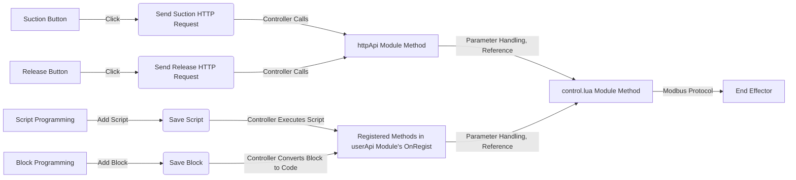

# IO Control

> This tutorial will implement a plugin to control the suction and release of a vacuum gripper.

The workflow of this plugin is as follows:



## Create a Plugin

```bash
# Node.js v20 or above is required
dpt create
```

During the plugin initialization, you will need to provide the following information:

- **Plugin Name** (required): Must not conflict with any existing folder in the current directory.
- **Plugin Description** (optional): Can be modified later in the configuration file.
- **Plugin Version** (optional): Default is `1-0-0-test`.
- **IP Address of the Robot Controller** (optional): Default is `192.168.5.1`, can be changed later in the configuration file.

Example of the initialization process:

```bash
$ dpt create
? Please input plugin name: io
? Please input plugin description: An io control demo
? Please input plugin version: 1-0-0
? Please input device IP: 192.168.5.1
```

Once the basic information is configured and filled in, the program will automatically execute the installation process:

```bash
Packages: +587
Downloading antd@5.20.3: 9.80 MB/9.80 MB, done
Progress: resolved 588, reused 582, downloaded 5, added 587, done

dependencies:
+ @dobot-plus/components 0.0.0
+ antd 5.20.3
+ axios 1.7.5
+ i18next 23.14.0
+ pubsub-js 1.9.4
+ react 18.3.1
+ react-dom 18.3.1
+ react-i18next 15.0.1
+ react-redux 9.1.2
+ redux 5.0.1

devDependencies:
+ @types/node 20.16.1 (22.5.0 is available)
+ @types/pubsub-js 1.8.6
+ @types/react 18.3.4
+ @types/react-dom 18.3.0
+ @types/react-redux 7.1.33
+ @typescript-eslint/eslint-plugin 7.18.0 (8.3.0 is available)
+ @typescript-eslint/parser 7.18.0 (8.3.0 is available)
+ add 2.0.6
+ css-loader 7.1.2
+ eslint 8.57.0 (9.9.1 is available)
+ eslint-plugin-react-hooks 4.6.2
+ eslint-plugin-react-refresh 0.4.11
+ postcss-loader 8.1.1
+ sass 1.77.8
+ sass-loader 16.0.1
+ style-loader 4.0.0
+ ts-loader 9.5.1
+ typescript 5.5.4
+ url-loader 4.1.1
+ webpack 5.94.0

Done in 39.7s
```

**⚠️ Note:** After the plugin folder is initialized, VS Code will start installing some extensions according to the configuration. Please allow the installation to proceed smoothly, as failure to do so could affect the Lua script debugging process.

Once the command line outputs similar content, the plugin project folder has been successfully created.

The directory structure is as follows:

```bash
io
├── Resources
│   ├── document
│   │   └── config.json
│   ├── i18n
│   │   ├── client
│   │   │   ├── de.json          # German translations for client
│   │   │   ├── en.json          # English translations for client
│   │   │   ├── es.json          # Spanish translations for client
│   │   │   ├── hk.json          # Traditional Chinese translations for client
│   │   │   ├── ja.json          # Japanese translations for client
│   │   │   ├── ko.json          # Korean translations for client
│   │   │   ├── ru.json          # Russian translations for client
│   │   │   └── zh.json          # Simplified Chinese translations for client
│   │   └── plugin
│   │       ├── de.json          # German translations for plugin UI
│   │       ├── en.json          # English translations for plugin UI
│   │       ├── es.json          # Spanish translations for plugin UI
│   │       ├── hk.json          # Traditional Chinese translations for plugin UI
│   │       ├── ja.json          # Japanese translations for plugin UI
│   │       ├── ko.json          # Korean translations for plugin UI
│   │       ├── ru.json          # Russian translations for plugin UI
│   │       └── zh.json          # Simplified Chinese translations for plugin UI
│   └── images
│       └── pallet.svg           # Image resources (e.g., SVG graphics)
├── configs
│   ├── Blocks.json              # Configuration for block programming
│   ├── Main.json                # Main plugin configuration file
│   ├── Scripts.json             # Configuration for script programming
│   └── Toolbar.json             # Toolbar configuration
├── dpt.json                     # Debugging configuration
├── lua
│   ├── daemon.lua               # Main process Lua script
│   ├── control.lua              # Control module Lua script
│   ├── httpAPI.lua              # HTTP API handling Lua script
│   ├── userAPI.lua              # User API for block and script programming
│   └── utils                    # Utility Lua scripts
│       ├── await485.lua         # Utility for 485 communication protocol
│       ├── mqtt.lua             # MQTT connection utility
│       ├── num_convert.lua      # Number conversion utility
│       ├── util.lua             # General utility functions
│       └── variables.lua        # Variable definitions and constants
├── package.json                 # Node.js dependencies
├── pnpm-lock.yaml               # pnpm lock file
├── tsconfig.json                # TypeScript configuration
└── ui
    ├── Blocks.tsx               # UI for block programming
    ├── Main.tsx                 # Main UI component for the plugin
    └── Toolbar.tsx              # Toolbar UI component
```

This structure includes resource files, internationalization (i18n), Lua scripts for the controller, TypeScript components for the UI, and configuration files for various parts of the plugin.

### Mechanical Arm & End Effector Control

The control logic for the robotic arm and the end effector is written in the `control.lua` file. For this plugin, we will create two functions:

- **Grip function**: Controls the suction operation.
- **Release function**: Stops the suction operation.

We'll write the `control.lua` and `httpAPI.lua` files and then integrate the functionality with the user interface (UI).

---

### Step 1: Edit `control.lua`

This file contains the main logic to control the arm’s suction and release actions.

```lua
local control = {}

-- Define function 'grip' to control suction operation
function control.grip()
    -- Set the input signal of the first terminal to ON (suction activated)
    ToolDO(1, 1)
end

-- Define function 'release' to stop suction operation
function control.release()
    -- Set the input signal of the first terminal to OFF (suction deactivated)
    ToolDO(1, 0)
end

return control
```

When the user hovers over the function in the editor, a tooltip with information such as function description, parameter types, and return values will appear.

    

### Step 2: Write `httpAPI.lua`

The `httpAPI.lua` file will handle the HTTP requests from the UI and trigger the corresponding functions (grip or release) in the `control.lua` file. This setup allows the UI to interact with the robotic arm's end effector.

```lua
local control = require('control')  -- Import the control module
local httpModule = {}

-- Define an HTTP POST handler for the grip function
httpModule.grip = function()
   control.grip()    -- Call the grip function from control.lua
   return {
       success = true  -- Return success response
   }
end

-- Define an HTTP POST handler for the release function
httpModule.release = function()
   control.release()  -- Call the release function from control.lua
   return {
       success = true  -- Return success response
   }
end

return httpModule  -- Return the httpModule with both handlers
```

### Step 3: Lua Pre-debugging

To ensure the Lua scripts are functioning properly, you can pre-debug them locally:

1. Run the following command from the root directory of your project:

   ```bash
   dpt lua
   ```

2. Choose the Lua script you want to run for local testing.

3. Developers can print logs and check for issues with module imports, syntax, or logic in the Lua scripts. This helps catch any potential problems before deployment.

### Control Interface

First Write the network request module `.dobot/http/http.ts`

```typescript
import { request } from './axios'

export const grip = (data: any) => {
  return request({
    url: 'grip',
    data
  })
}

export const release = (data: any) => {
  return request({
    url: 'release',
    data
  })
}
```

In this step, you'll create the plugin's control interface in `ui/Main.tsx`. This interface will allow the user to control the robotic arm's end effector by sending HTTP requests to trigger the `grip` and `release` functions.

```jsx
import { Button } from '@dobot-plus/components' // Importing Button component
import { useTranslation } from 'react-i18next' // Importing translation hook
import { http, DobotPlusApp } from '@dobot/index' // Importing http module and DobotPlusApp

function App() {
  const { t } = useTranslation() // Using translation hook for multi-language support

  // Function to handle the "Grip" button click
  function handleButton1Click() {
    http.grip() // Call the grip function over HTTP
  }

  // Function to handle the "Release" button click
  function handleButton2Click() {
    http.release() // Call the release function over HTTP
  }

  return (
    <div className="app">
      <DobotPlusApp>
        {' '}
        {/* Main container for Dobot Plus App */}
        <h1>{t('testKey')}</h1> {/* Translatable header */}
        <Button type="primary" onClick={handleButton1Click}>
          Grip
        </Button> {/* Grip button */}
        <Button type="primary" onClick={handleButton2Click}>
          Release
        </Button>{' '}
        {/* Release button */}
      </DobotPlusApp>
    </div>
  )
}

export default App // Exporting the component
```

### Debugging and Validation

To debug and validate the plugin, you can work in two modes:

- Debug only the UI
- Debug with a connected real device

Run the following command to start debugging:

```bash
dpt dev
```

The command will prompt you to confirm if you'd like to connect to a real device for debugging:

```bash
$ dpt dev
? Debug lua on real device? Yes
? Please check the device IP: 192.168.5.1 (y/n)
```

You will need to ensure that:

- The real device's IP address is correct (default: `192.168.5.1`)
- The SFTP service configuration is correct

These configurations can be checked and updated in the `dpt.json` file:

```json
{
  "ip": "192.168.5.1", // Controller IP
  "pluginPort": 22100 // Plugin port number
}
```

When connected to the real device for debugging:

- Once the plugin is successfully installed and connected to the controller, the plugin port will be automatically updated.
- Any Lua file changes will be automatically synced with the controller, allowing you to control the robot's end effector via the web interface.

### Building the Plugin

Once you have completed the plugin development, testing, and optimization, you can build the final plugin package by running:

```bash
dpt build
```

After the build is complete, the following folders will be created:

- `dist`: Contains the compiled plugin code for developers to inspect
- `output`: Contains the compressed plugin file (ZIP format) for client-side import. The file name will follow the format `<plugin-name>-<version-number>.zip`.

This ZIP file is what you'll use to import the plugin into the Dobot Studio client.

## ⚠️ Important Notes

- **Automatic HTTP Request Generation:**
  The plugin automatically generates a frontend HTTP request file based on the methods written in the `lua/httpAPI.lua` module. Developers can import and use this file as follows:

  ```javascript
  import { http } from '@dobot/index'
  ```

  Once imported, you can make HTTP requests by calling functions with the same names as those defined in `lua/httpAPI.lua`.

  **Example:**

  In the `.ts` or `.tsx` files within the `UI` folder:

  ```javascript
  // Send an HTTP request to trigger the 'grip' function in httpAPI.lua
  http.grip()

  // Send an HTTP request to trigger the 'release' function in httpAPI.lua
  http.release()
  ```

- **Customizing HTTP Requests:**
  By default, the plugin generates the necessary HTTP configuration for the UI, mapping HTTP requests to the functions defined in `lua/httpAPI.lua`. If developers wish to manually configure requests, they can create a `.dobot/http/api.json` file. Currently, only the `POST` method is supported.

  **Example:**

  ```json
  {
    "requestGrip": {
      "url": "grip"
    },
    "requestRelease": {
      "url": "release"
    }
  }
  ```

  To use these custom configurations:

  ```javascript
  import { http } from '@dobot/index'

  http.requestGrip() // Calls the grip function defined in httpAPI.lua
  http.requestRelease() // Calls the release function defined in httpAPI.lua
  ```

  The URLs specified in the `api.json` file must correspond to the function names in the `httpAPI.lua` module. This ensures that the controller calls the correct methods.

- **`DobotPlusApp` Component:**
  `DobotPlusApp` is a React higher-order component (HOC) that handles WebSocket setup and retrieves the plugin port. It provides the following optional props:

  - `useMqtt`: Whether to use MQTT protocol for receiving messages from the controller. The default is `false`.
  - `onMessage`: A function to handle messages received from the controller via MQTT protocol.

- **UI Files Compilation:**
  During the build process, all `.tsx` files in the top level of the `ui` directory will be compiled into corresponding pages:
  - `Main.tsx`: Represents the plugin's main page.
  - `Toolbar.tsx`: Represents the plugin's toolbar page.
  - `Blocks.tsx`: Represents the plugin's blocks window page.
  - Other `.tsx` files in the top level of `ui` will also be compiled into pages, so developers should carefully name their files to avoid unintended behavior.
