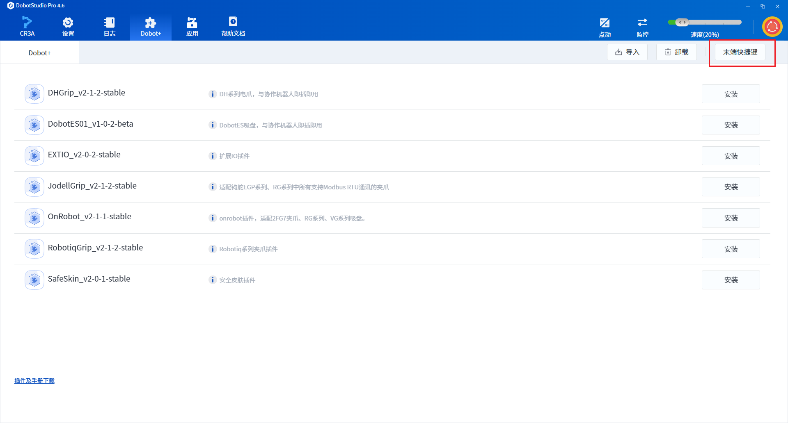
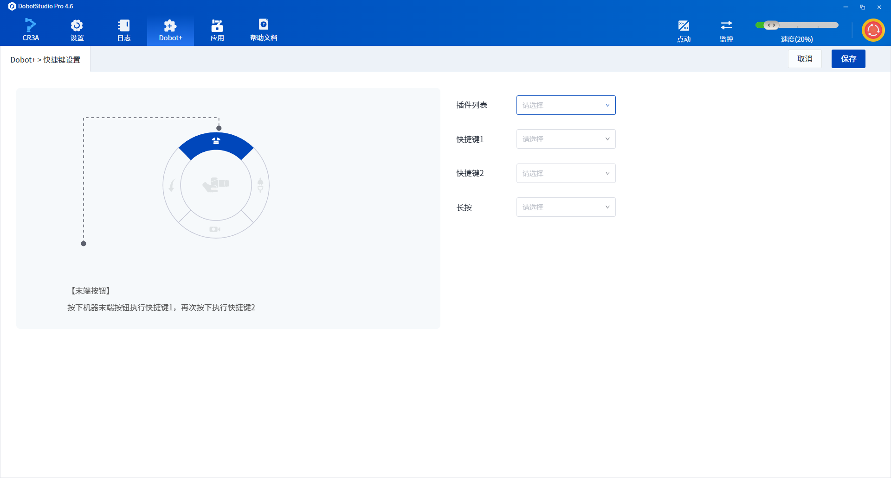
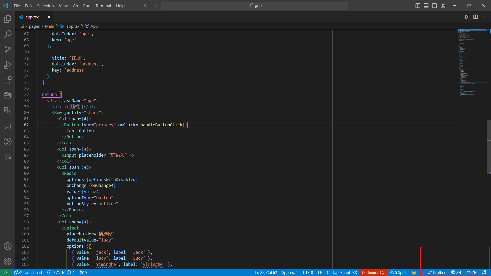
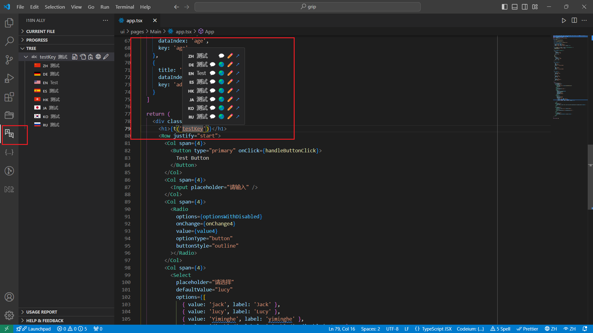

# Hotkey Control
> After completing the [IO Control Example](./01-io.md) and debugging, the IO works as expected. Now we can make richer configurations for this plugin.

## Registering Keyboard Shortcuts
The purpose of `httpAPI.lua` is to provide external interfaces, including keyboard shortcuts and UI, where user interactions with the machine will be centralized in the `httpAPI.lua` module.

- **Edit `httpAPI.lua`**

    ```lua
    local control = require('control')
    local httpModule = {}
    
    -- Add a function to handle HTTP POST requests named grip
    httpModule.grip = function()
       control.grip()    
       return {
           success = true
       }
    end
    
    -- Add a function to handle HTTP POST requests named release
    httpModule.release = function()
       control.release() 
       return {
           success = true
       }
    end

    -- Register method names for shortcut keys to be used at the end, "grip" controls gripping, "release" controls releasing
    httpModule.OnRegistHotKey = function() 
         return {
            -- Operations that can be executed by pressing the shortcut keys, developers can decide which actions can be registered to shortcuts, with no limit to the number
            -- "grip" points to the httpApi.grip function
            -- "release" points to the httpApi.release function
            press = { "grip", "release" } 
            -- Long press shortcut operations, unlimited
            longPress = {} 
        }
    end    

    return httpModule
    ```
- Client Configuration of Keyboard Shortcuts

  Users can select the **End Effector Hotkeys** menu in the `Dobot+` menu.

  

  Select the current plugin from the plugin list.

  

  In the dropdown menu for the corresponding shortcut key, choose the corresponding method from `httpAPI.lua`.


## Script Programming Configuration

The current developer tool provides a configurable Web GUI tool. Run the following command:

```bash
dpt gui
```

When the console displays the following information, it indicates that the GUI tool has started normally.

```
  ▲ Next.js 14.2.5
  - Local:        http://localhost:3000

 ✓ Starting...
 ✓ Ready in 958ms
```

Open the GUI tool at the address [http://localhost:3000](http://localhost:3000) in your browser.

- Function programming configuration management center

  

Developers can do the following on this page:

- View and edit the source code of the `userAPI.lua` module
- View the function programming configurations provided by the current project
- Add, edit, view, and delete function programming configurations for the current project

## Block Programming Configuration

- Block programming configuration management center


Developers can do the following on this page:
- Preview the effects of block configurations
- Add, edit, view, and delete block configuration information

All resources in this GUI tool support CRUD operations, and changes will synchronize with the plugin project. Users can also choose not to use this tool and directly modify the configuration files in the plugin folder under `config`. This folder supports format correctness verification and prompts for optional content. If warnings occur, it indicates that the configuration file is abnormal, which may affect real usage and debugging. Please do not ignore the warnings.

```bash
io # Project root directory
└── configs
   ├── Blocks.json  # Block configuration
   ├── Main.json    # Plugin information configuration
   ├── Scripts.json # Script programming configuration
   └── Toolbar.json # Toolbar configuration
```

## Internationalization Translation

The configuration for internationalization translation currently supports three methods:
- **VSCode Plugin**: This operation relies on the `lokalise.i18n-ally` plugin, and the configuration work for this plugin has been completed during initialization. After the plugin is created, there will be installation prompts. If issues arise, developers should check the specific reasons in the VSCode plugin. This plugin supports:
    - Preview of translated texts
    - Multi-language switching display
    - Visual editing tools for content
    - Automatic one-click translation when connected to the internet
- **Web App Management Tool**: This is a browser-based GUI tool designed to provide developers with a management interface for translation resources. It supports CRUD operations for translation content, allowing developers to make targeted changes to translation resources.
- **Manual User Maintenance**: For developers who prefer to maintain translation resources themselves, modifications can be made directly in the `Resources/i18n` and `ui/locals` folders for the corresponding language. Currently, support is available for languages from eight regions: German (DE), Japanese (JA), Korean (KO), Russian (RU), Spanish (ES), English (EN), Simplified Chinese (ZH), and Traditional Chinese (HK).

- The current internationalization resources support translation previews.

    

    The word "测试" in the sample code is a keyword for translation. Click the button in the lower right corner to switch the displayed language and select the desired language to view its translation.

- When editing translation resources, developers can click the translation function button in the VSCode sidebar or double-click the translation field to be edited. Hovering over the keyword for a moment will display the corresponding editing box, allowing developers to freely edit translation resources.

    

- Configuration file translation resource editing center.

    