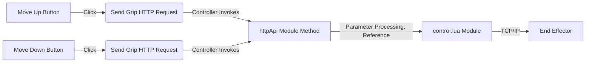

# TCP/IP Control

> Please refer to the [IO Control Case](./01-io.md) for the process of creating a plugin. After creating the plugin, please follow the order of `userAPI.lua`, `httpAPI.lua`, `daemon.lua`, and `ui/Main.tsx` to complete the development of the plugin's business logic.

## Example Workflow



## control.lua Module

```lua
local control = {}

---@param position string
---@param socket number
function control.moveTo(position, socket)
    TCPWrite(socket, "moveTo_absolutePosition"..","..position.."\n")
    TCPRead(socket, 3 , 'string')
end

return control
```

## httpAPI.lua Module

```lua
local httpModule = {}
local control = require('control')

local socket = nil

---Move the lift column
httpModule.moveTo = function(params)
  if socket then
    control.moveTo(params.position, socket)
  end
  return {
    status = true
  }
end

---Initialize TCP connection
httpModule.init = function(params)
  local result = CreateTCPConnection(params.ip, params.port, 10000)
  if result.socket then
    socket = result.socket
  end
  return {
    status = true
  }
end

return httpModule
```

## .dobot/http/http.ts Module

```typescript
import { request } from './axios'

export const init = (data: any) => {
  return request({
    url: 'init',
    data
  })
}

export const moveTo = (data: any) => {
  return request({
    url: 'moveTo',
    data
  })
}
```

## ui/Main.tsx Module

```jsx
import { Button } from '@dobot-plus/components'
import { useEffect, useState } from 'react'
import { http, DobotPlusApp } from '@dobot/index'

function App() {
  const [position, setPosition] = useState(0)

  function handleButton1Click() {
    http.moveTo({ position: position + 50 })
  }

  function handleButton2Click() {
    http.moveTo({ position: position - 50 })
  }

  useEffect(() => {
    http.init({
      ip: '192.168.5.1', // Default IP, update here when actual IP changes
      port: '123' // Enter the actual correct port number here
    })
  }, [])

  return (
    <div className="app">
      <DobotPlusApp>
        <Button type="primary" onClick={handleButton1Click}>
          Move up
        </Button>
        <Button type="primary" onClick={handleButton2Click}>
          Move down
        </Button>
      </DobotPlusApp>
    </div>
  )
}

export default App
```

## Running and Debugging

The debugging command for the plugin can perform the following two types of development work:

- Debug only the page
- Connect to a real device for debugging

```bash
dpt dev
```

When executing the above command, the command line will prompt developers whether to connect a real device for testing.

```bash
$ dpt dev
? Debug lua on real device? Yes
? Please check the device IP: 192.168.5.1 (y/n)
```

Developers need to confirm:

- Whether the actual IP of the controller is correct; the default is `192.168.5.1`
- Whether the SFTP service-related configuration is correct

For detailed information on the above configurations, please refer to the `dpt.json` configuration file.

```json
{
  "ip": "192.168.5.1", // Controller IP
  "pluginPort": 22100
}
```

## Building the Plugin

After completing the development, debugging, and optimization of the plugin, you can execute the final build work by running:

```bash
dpt build
```

After the program executes successfully, there will be a `dist` folder and an `output` folder in the current directory.

- The `dist` folder contains the plugin code after this build, allowing developers to check the build results.
- The `output` folder contains a compressed `zip` file named in the format `<plugin_name>-<version_number>.zip`, which is the plugin to be imported for actual use on the client.
