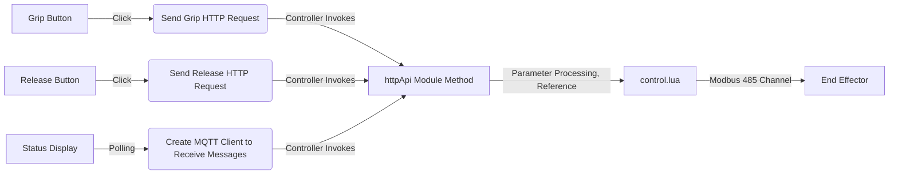

# Gripper Control

> This example will complete the development of a suction cup plugin for gripping and releasing workpieces.

## Plugin Initialization

The plugin initialization work can refer to the initialization process in the [IO Control Case](./01-io.md).

## Plugin Workflow

The workflow of this plugin is as follows:



## Control Functions

Write `control.lua`

```lua
local numConvert = require('utils.num_convert')
local control = {}
local modbusID = nil

-- Define the grip function to control the gripping operation
function control.grip(id)

    if modbusID == nil then
        local err, _modbus = ModbusCreate("127.0.0.1", 60000, id, true)
        if err ~= 0 then
            -- Failed to create Modbus connection
            return nil
        else
            -- Successfully created Modbus connection
            modbusID = _modbus
        end
    end

    if modbusID ~= nil then
        local gripCmd = tonumber('00001001'..'00000000', 2)
        local gripParams = 0
        WriteBy485(modbusID, 0x03E8, { gripCmd, gripParams })
    end
end

function control.release(id)

    if modbusID == nil then
        local err, _modbus = ModbusCreate("127.0.0.1", 60000, id, true)
        if err ~= 0 then
            -- Failed to create Modbus connection
            return nil
        else
            -- Successfully created Modbus connection
            modbusID = _modbus
        end
    end

    if modbusID ~= nil then
        local releaseCmd = tonumber('00001001'..'00000000', 2)
        local releaseParams = 100
        WriteBy485(modbusID, 0x03E8, { releaseCmd, releaseParams })
    end
end

---@param id number
---@return table|nil status
function control.getStatus(id)
    if modbusID == nil then
        local err, _modbus = ModbusCreate("127.0.0.1", 60000, id, true)
        if err ~= 0 then
            -- Failed to create Modbus connection
            return nil
        else
            -- Successfully created Modbus connection
            modbusID = _modbus
        end
    end

    local status = false
    if modbusID ~= nil then
        Use485()
        local registerData = GetHoldRegs(modbusID, 0x07D0, 3)
        UnLock485()
        if registerData[1] == nil then
            return false
        end
        local bitData = numConvert.decimalToBinary(registerData[1])
        return string.sub(bitData, -6, -5) == '11'
    end

    return status
end

return control
```

## Network Requests

Write `httpAPI.lua`

```lua
local httpModule = {}
local control = require("control")

-- Define the grip function to control the gripping operation
function httpModule.grip(params)
    control.grip(params.id)
    return {
        status = true
    }
end

function httpModule.release(params)
    control.release(params.id)
    return {
        status = true
    }
end

return httpModule
```

## Status Synchronization

- Write `lua/daemon.lua`

```lua
local control = require('control')

local function handleInLoop()
    -- Default id for Epick suction cup is 9
    local data = control.getStatus(9)
    if data ~= nil or data ~= false then
        mqtt.publish(data)
    else
        mqtt.publish({
            status = false
        })
    end
end
```

- Write `.dobot/http/http.ts`

```typescript
import { request } from './axios'

export const grip = (data: any) => {
  return request({
    url: 'grip',
    data
  })
}

export const release = (data: any) => {
  return request({
    url: 'release',
    data
  })
}
```

- Write `ui/Main.tsx`

```jsx
import { Button, StatusLight } from '@dobot-plus/components'
import { useState } from 'react'
import { useTranslation } from 'react-i18next'
import { http } from '@dobot/http/http'
import { DobotPlusApp } from '@dobot/components/DobotPlusApp'

function App() {
    const { t } = useTranslation()

    const [status, setStatus] = useState(false)

    function handleButton1Click() { http.grip({id: 9 }) }

    function handleButton2Click() { http.release({ id: 9 }) }

    function handleMessage(data: object | string) {
        if (typeof data === 'object') {
            const { status } = data as { status: boolean }
            setStatus(status)
        }
    }

    return (
        <div className="app">
            <DobotPlusApp useMqtt={true} onMessage={handleMessage}>
                <Button type="primary" onClick={handleButton1Click}>Grip</Button>
                <Button type="primary" onClick={handleButton2Click}>Release</Button>
                <StatusLight status={status ? 'success' : 'error'}
                    statusText={status ? 'Normal' : 'Abnormal'}>
                </StatusLight>
            </DobotPlusApp>
        </div>
    )
}

export default App
```

## Debugging

The debugging command for the plugin can perform the following two types of development work:

- Debug only the page
- Connect to a real device for debugging

```bash
dpt dev
```

When executing the above command, the command line will prompt developers whether to connect a real device for testing.

```bash
$ dpt dev
? Debug lua on real device? Yes
? Please check the device IP: 192.168.5.1 (y/n)
```

Developers need to confirm:

- Whether the actual IP of the controller is correct; the default is `192.168.5.1`
- Whether the SFTP service-related configuration is correct

For detailed information on the above configurations, please refer to the `dpt.json` configuration file.

```json
{
  "ip": "192.168.5.1", // Controller IP
  "pluginPort": 22100
}
```

## Building the Plugin

After completing the development, debugging, and optimization of the plugin, you can execute the final build work by running:

```bash
dpt build
```

After the program executes successfully, there will be a `dist` folder and an `output` folder in the current directory.

- The `dist` folder contains the plugin code after this build, allowing developers to check the build results.
- The `output` folder contains a compressed `zip` file named in the format `<plugin_name>-<version_number>.zip`, which is the plugin to be imported for actual use on the client.
