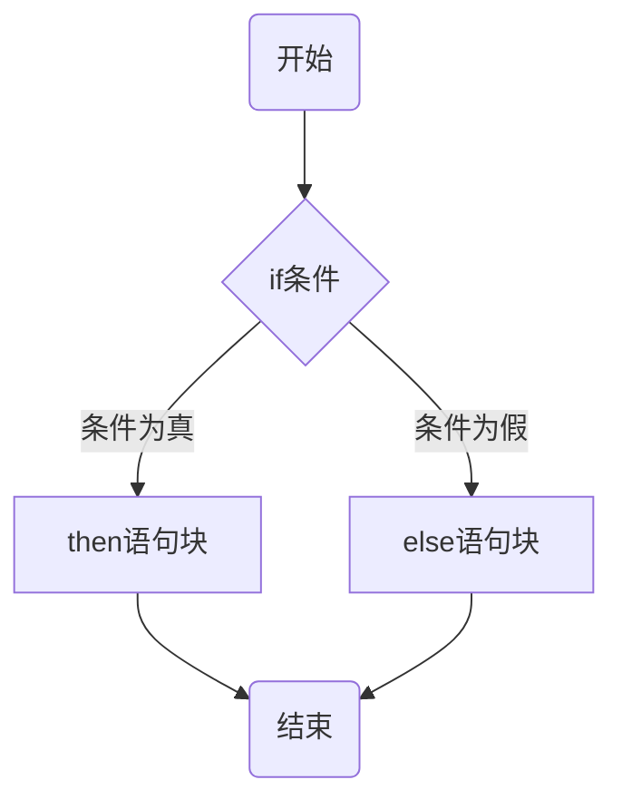
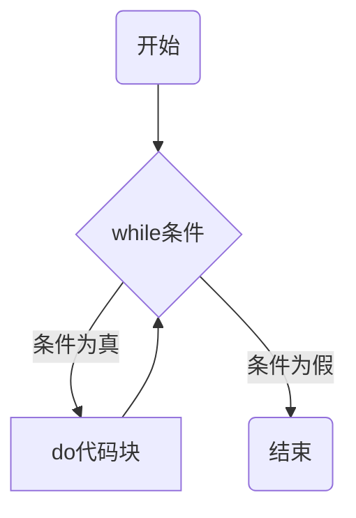
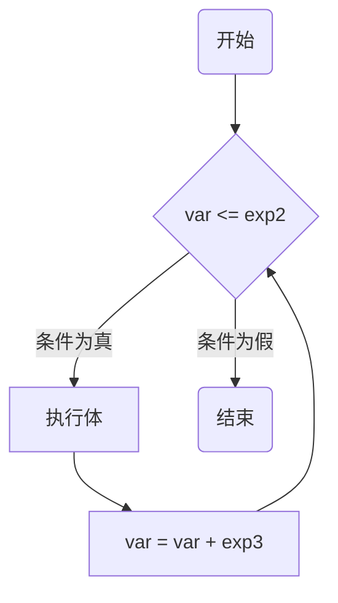
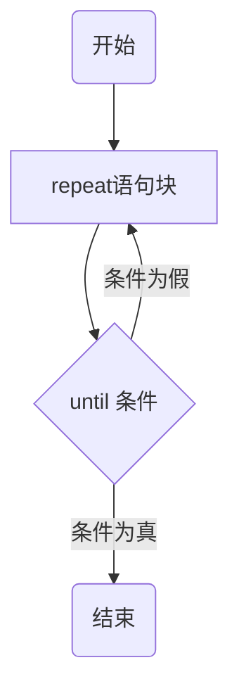

# Logic

> Different versions of controllers, plugins, and upper computers support different Lua API commands. Developers can view the specific supported Lua APIs in the "Application" menu of DobotStudio Pro, under the "Script Programming" command sidebar.

Control flow statements in Lua allow you to dictate the order in which instructions are executed, enabling decision-making and repetitive actions in your programs.

## Control Flow Statements Overview

| Statement                | Description                                                                                                                                          |
| ------------------------ | ---------------------------------------------------------------------------------------------------------------------------------------------------- |
| `if...then...else...end` | Conditional statement that checks conditions from top to bottom. If a condition is `true`, it executes the corresponding block and ignores the rest. |
| `while...do...end`       | A loop that repeatedly executes a block of code as long as the condition is `true`. The condition is checked before executing the block.             |
| `for...do...end`         | A loop that executes a block of code a specific number of times, controlled by the `for` statement.                                                  |
| `repeat...until`         | A loop that repeatedly executes a block of code until a specified condition is `true`. The condition is checked after executing the block.           |

## `if` Conditional Statement

The condition following `if` can be any expression. Lua treats `false` and `nil` as false, while everything else (including `0`) is true. If the expression is true, the code block following `then` is executed; if false, the code block following `else` (if present) is executed.

### Flowchart:



### Example:

```lua
a = 100
b = 200

-- Check condition
if (a == 100) then
    -- Execute this block if the condition is true
    if (b == 200) then
        print("a 的值为:", a)  -- a 的值为: 100
        print("b 的值为:", b)  -- b 的值为: 200
    end
else
    -- Execute this block if the first condition is false
    print("a不等于100")
end
```

## `while` Loop Control Statement

In a `while` loop, the condition is checked before executing the block of code. If the condition is true, the code block inside `do` is executed.

### Flowchart:



### Example:

```lua
a = 10
while (a < 20) do
    print("a 的值为:", a)  -- Outputs values from 10 to 19
    a = a + 1
end
```

## `for` Loop Control Statement

The `for` loop syntax is as follows:

```lua
for var = exp1, exp2, exp3 do
    <执行体>
end
```

Here, `var` starts at `exp1` and increments by `exp3` (which can be negative or omitted, defaulting to `1`) until `var` exceeds `exp2`.

### Flowchart:



### Example:

```lua
for i = 10, 1, -1 do
    print(i) -- Outputs values from 10 to 1
end
```

## `repeat` Loop Control Statement

The `repeat` loop checks the condition after executing the block of code, meaning the block is executed at least once before the condition is evaluated.

### Flowchart:



### Example:

```lua
a = 10
repeat
    print("a的值为:", a) -- Outputs values from 10 to 15
    a = a + 1
until (a > 15)
```

These control flow statements provide the necessary structure to implement logic in your Lua programs, enabling complex decision-making and iterations.
