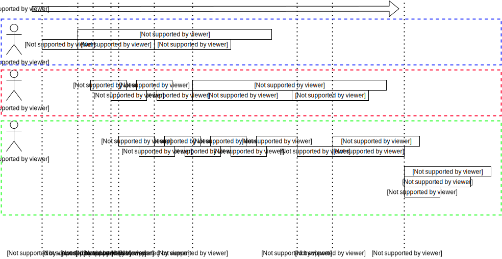

# Distributed Lock

> Different versions of controllers, plugins, and upper computers support different Lua API commands. Developers can view the specific supported Lua APIs in the "Application" menu of DobotStudio Pro, under the "Script Programming" command sidebar.

## Description

The introduction of the distributed lock module mainly aims to solve the data conflicts caused by multiple modules using the same resources.

A typical application scenario is when a gripper and a camera simultaneously use the terminal's 485 communication. Both parties' plugins and user scripts need to communicate with the terminal's 485, but the 485 module cannot determine which party exclusively owns the communication at any given time. Therefore, an additional tool is needed to manage the exclusive relationship between resources.

### Example to Illustrate the Role of Timeout Locks:

Assume there is a printer that can immediately print received print requests. Suppose there are three users, A, B, and C, who have print requests. Their print tasks are A1, A2, A3... A10, B1, B2...B10, C1...C10, respectively. If there is no communication among them and they print when they need to, the output might be mixed, such as A1, B1, A2, C1, etc. In this case, the printed content does not meet any user's requirements, leading to complex logic for users to organize their data. Sometimes, they may even end up with incorrect data.

To resolve this issue, a new “administrator” is introduced, responsible for managing the use of the “printer.” Assume that A is the first to recognize their printing needs and promptly reports them to the administrator. At this point, the administrator records that the “printer” is exclusively owned by A for 2 minutes, allowing A to print their required content during this time. B and C will try to report their needs to the administrator during this period, but the administrator will ask B and C to wait. The administrator will only inform B and C when A's 2 minutes are up or when A finishes early.

The overall timeline diagram is as follows:

1. At this moment, the resource “printer” is idle. User A tries to apply for usage rights and is immediately approved. After approval, A provides an estimated usage time (the maximum designed time is currently 10 seconds).
2. The resource “printer” begins to be used.
3. B applies to use the resource, but the administrator knows that the resource is still with A, so B's application is denied. B is asked to wait.
4. B applies again and is denied again.
5. C starts applying for the resource “printer,” but the administrator denies C's request.
6. A actively informs the administrator that the use of the resource “printer” has ended.
7. After A's usage ends, B applies for the resource “printer,” and the administrator informs B that they can use it.
8. After B has finished using the printer, C applies for the resource and obtains the usage rights through the administrator.
9. C begins using the resource.
10. C finds that the initial usage time reported to the administrator is insufficient and requests more time while the resource is still in use. The administrator agrees to extend C’s usage.

## Interfaces

**Lock(name, TimeOut, WaitTime)**

- **Function:** Apply to lock the resource; only requests can be made.
- **Parameter Description:**

| Parameter | Range                   | Description                                                                                                                                                       |
| --------- | ----------------------- | ----------------------------------------------------------------------------------------------------------------------------------------------------------------- |
| name      | A string without spaces | No length limit has been set, but it is recommended to not exceed 128 bytes.                                                                                      |
| TimeOut   | [10,10000]              | The time to exclusively occupy the resource, in milliseconds.                                                                                                     |
| WaitTime  | [0,0x7FFFFFFF]          | Optional parameter, the timeout for waiting. 0 means no waiting and returns immediately; greater than 0 means the maximum waiting time. Internally uses u32 type. |

- **Return Value Description:**

| Return Value | Range      | Description                                                         |
| ------------ | ---------- | ------------------------------------------------------------------- |
| err          | true/false | Whether it was successful; true means success, false means failure. |

**UnLock(name)**

- **Function:** Actively release the resource.
- **Parameter Description:**
  - **name:** The name of the resource to be released, of string type, with the same range, content, and recommendations as TimeOutLock.
- **Return Value Description:**

| Return Value | Description                                                                                |
| ------------ | ------------------------------------------------------------------------------------------ |
| err          | Indicates whether there was an error; true means no error, false means there was an error. |
