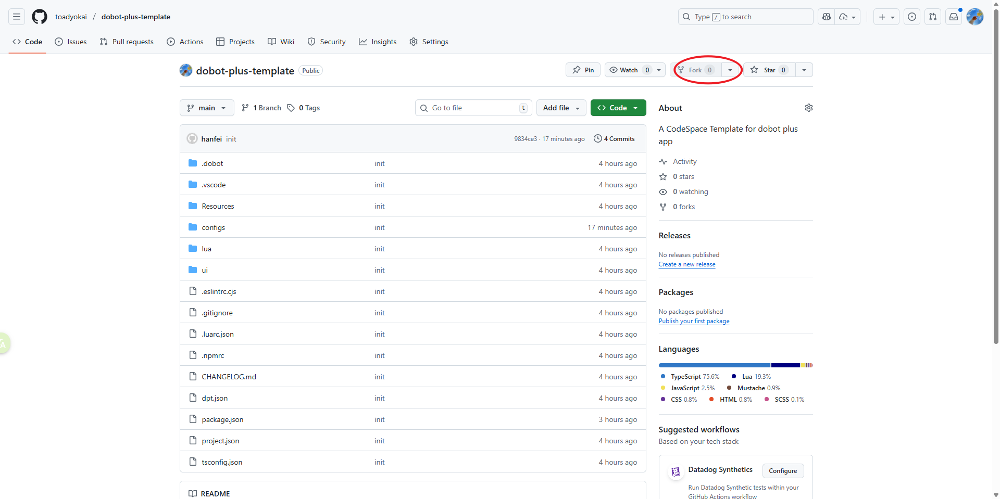
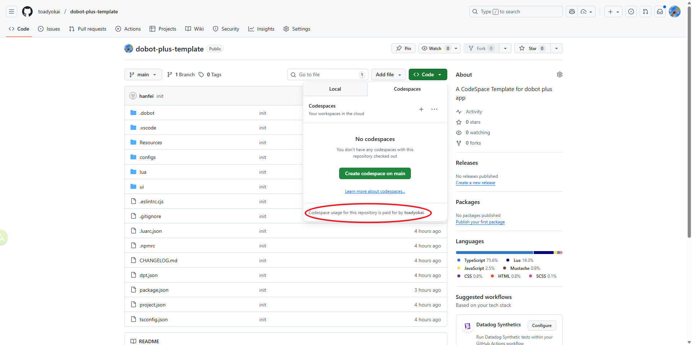
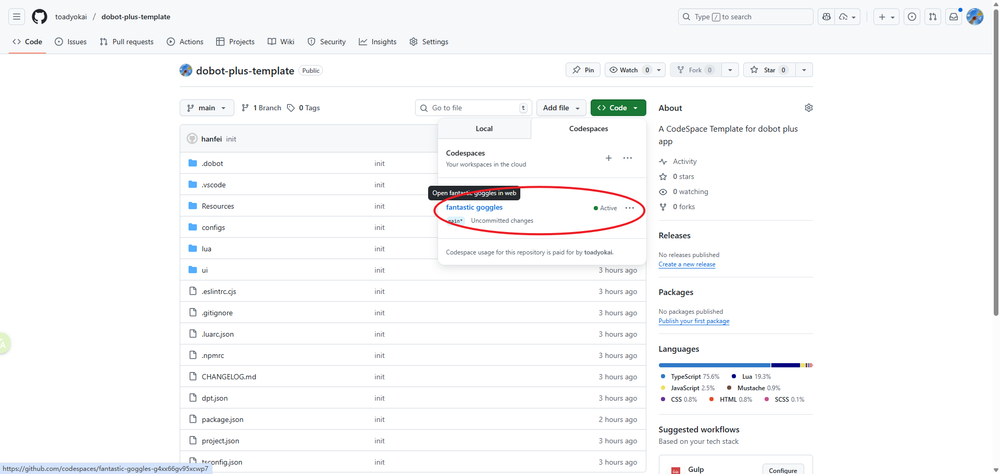
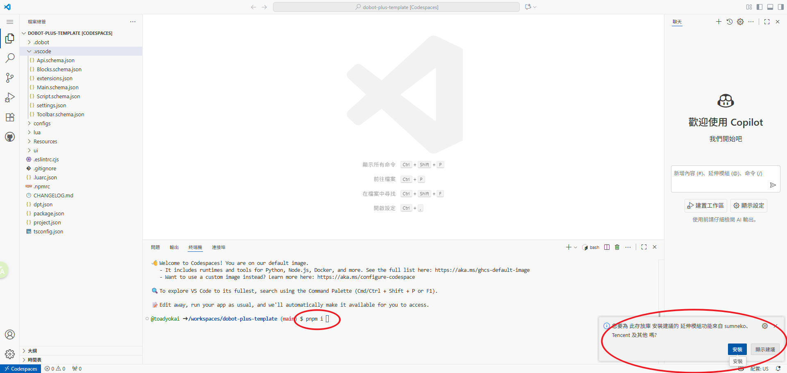
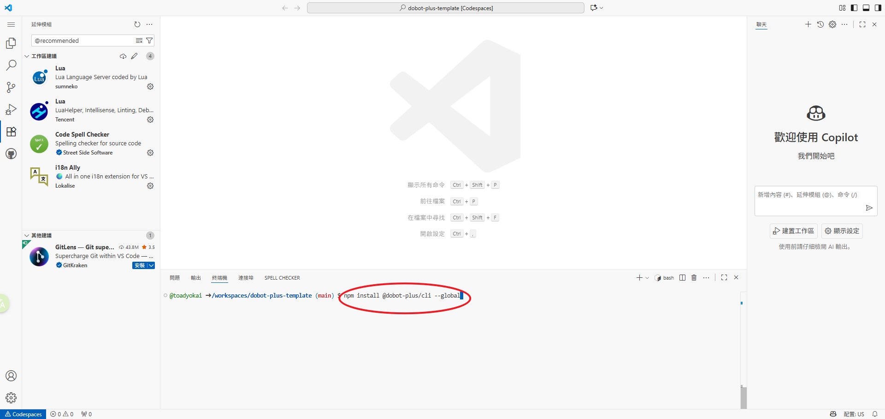
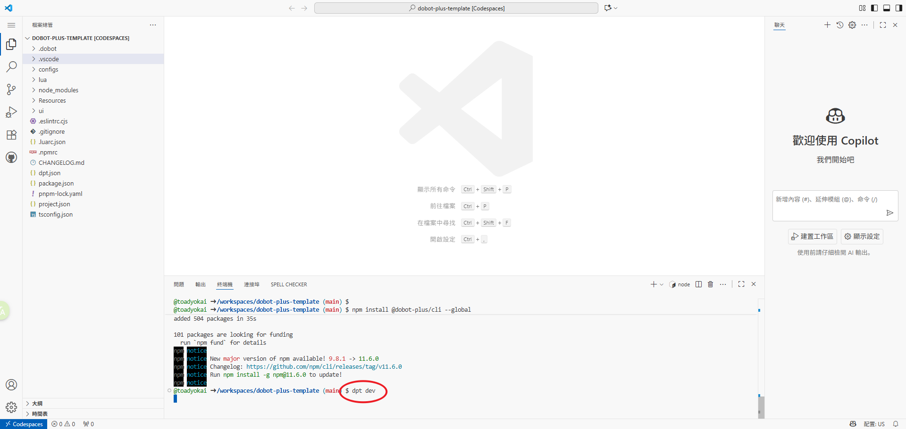
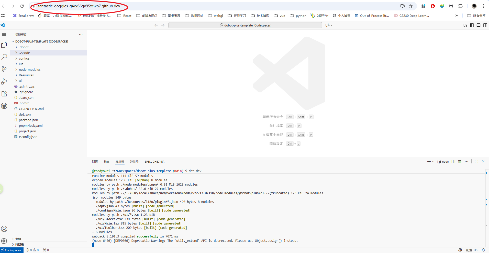
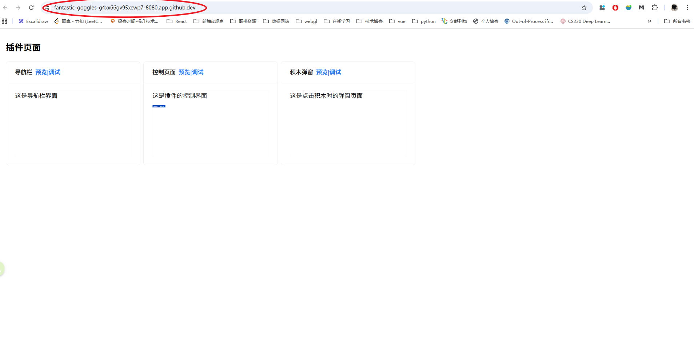
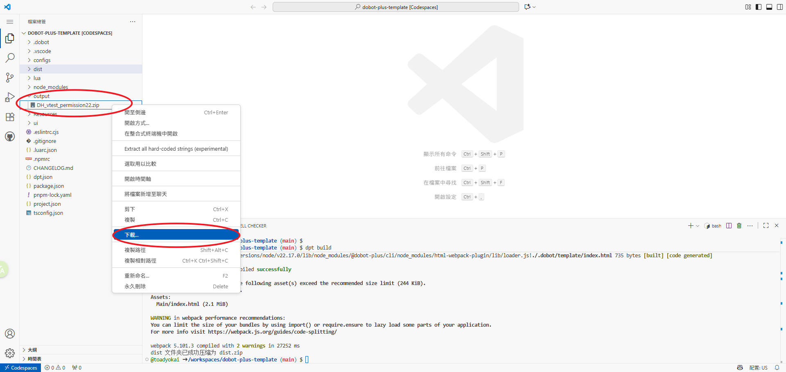

# Development in GitHub Codespace

Dobot+ plugin development also supports cloud development in GitHub Codespaces.  
Developers can create a copy of the Dobot+ plugin template and develop in the cloud on their own branch, without the need to set up a local development environment.



- Dobot+ Plugin Template Repository: https://github.com/toadyokai/dobot-plus-template.git
- Dobot+ Plugin Template NPM Package: https://www.npmjs.com/package/@dobot-plus/template

Developers can fork the template repository to their own repository, or manually download the Dobot+ plugin template, create a repository locally, and push it to GitHub.

Codespaces is a paid service.



Individual developers have a free monthly quota of [15GB storage and 120 hours of compute time](https://docs.github.com/zh/billing/concepts/product-billing/github-codespaces#free-and-billed-use-by-personal-accounts).

## Environment Initialization

Under the Code menu on the page, users can create a Codespaces workspace for the current repository.


After the workspace is created, the browser will display the VS Code coding interface.



When entering for the first time, a pop-up in the lower right corner will recommend VS Code extensions for the Dobot+ template project. These extensions are helpful for improving development efficiency and are recommended for installation.

During remote container initialization, project dependencies and `@dobot-plus/cli` will be installed automatically. After opening the codespace, developers can check this in the terminal.

```bash
node -v # Check node version

pnpm -v # Check pnpm version

dpt -v  # Check dpt development tool version
```

**Note**

If the automation fails, developers can manually initialize dependencies:

```bash
# Install npm dependencies for the current template project
pnpm i

# Install Dobot+ development and debugging tool
npm install @dobot-plus/cli --global
```



After completing the above steps, the basic cloud development environment is set up.

Developers can run the following commands in the terminal to check if the tool versions meet the requirements.

## Development and Debugging

After codespace initialization, run the following in the terminal:

```bash
dpt dev
```

This is the same as running

```
dpt dev
```

locally. Developers should ensure that browser pop-ups are enabled to allow the preview page to open and redirect automatically.

**Note**  
Debugging in codespace requires connecting to a virtual controller. Developers need to apply for a virtual controller for development and debugging, and update the virtual controller IP in the project's `dpt.json` configuration file.



After the above command executes successfully, the browser will automatically open the plugin preview page as shown below:


Developers can debug the interaction and style of the corresponding plugin interface as needed.

If the page does not open automatically, developers can manually construct the preview URL based on the current Codespaces URL. The default preview port is 8080.



Modify the part before `.github.dev` by adding `-8080` to manually open the preview link in the browser.



## Plugin Packaging

Run the plugin build command in the Codespaces terminal:

```
dpt build
```

After the build is complete, open the `output` folder in the file menu on the left, right-click the zip file, and select Download. After a short wait, the packaged plugin will be downloaded to your browser's download directory.



## Continue Development

Using Codespaces requires an internet connection. After completing a development session, if the Codespaces project is not deleted, it will be preserved. Developers can click the corresponding Codespaces to re-enter and continue development.


References

- [What is GitHub Codespaces?](https://docs.github.com/zh/codespaces/about-codespaces/what-are-codespaces)
- [Codespaces Billing Rules](https://docs.github.com/zh/billing/concepts/product-billing/github-codespaces)
